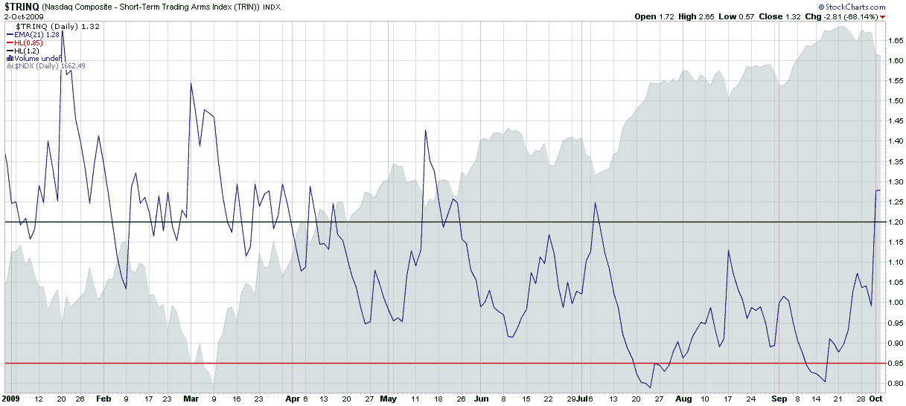

<!--yml

类别：未分类

日期：2024-05-18 17:27:41

-->

# VIX 和更多：本周图表：纳斯达克 TRIN

> 来源：[`vixandmore.blogspot.com/2009/10/chart-of-week-nasdaq-trin.html#0001-01-01`](http://vixandmore.blogspot.com/2009/10/chart-of-week-nasdaq-trin.html#0001-01-01)

【纳斯达克 TRIN】](http://vixandmore.blogspot.com/search/label/TRINQ)是一个我通常很少听到的指标，然而在一个科技股引领多数涨跌的市场中，我认为它值得更深入的研究。

在下面的【本周图表】中，我展示了一个简单的纳斯达克 TRIN 图表，它使用 21 天指数移动平均线来平滑一些常见于短期研究该指标的每日噪音。作为一个逆市场情绪指标，TRIN 有助于帮助识别市场转折点或短期反转的可能性。

下图显示，自市场在 3 月初企稳并触底以来，纳斯达克 TRIN 一直擅长于发出买入信号（在绿色水平线以下）和卖出信号（在红色水平线以上）。周五的 EMA 平滑读数为 1.28，自 5 月中旬触底以来最高，这表明当前的回调可能是另一个良好的买入机会。

无论您是否同意目前买入跌幅的方法，都应该努力关注纽约证券交易所[TRIN](http://vixandmore.blogspot.com/search/label/TRIN)（又名阿姆指数）和纳斯达克 TRIN 作为市场时机的信号。

对于想要深入了解 TRIN 和纳斯达克 TRIN 的读者，建议查阅以下资料：

*[来源：StockCharts]*
