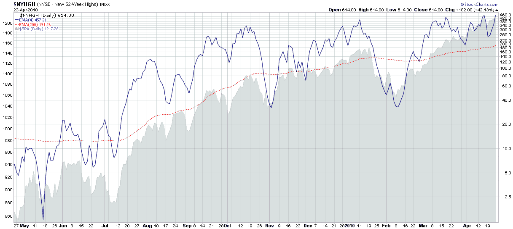

<!--yml

分类：未分类

日期：2024-05-18 17:11:23

-->

# VIX 和更多：本周图表：新的 52 周新高

> 来源：[`vixandmore.blogspot.com/2010/04/chart-of-week-new-52-week-highs.html#0001-01-01`](http://vixandmore.blogspot.com/2010/04/chart-of-week-new-52-week-highs.html#0001-01-01)

最近投资界对于股市是否目前超买有很多争论。当我查看个别股票的图表时，我注意到现在有很多股票正在创下新的[52 周新高](http://vixandmore.blogspot.com/search/label/52%20week%20highs)。

本周的[本周图表](http://vixandmore.blogspot.com/search/label/chart%20of%20the%20week)如下，记录了纽约证券交易所[52 周新高](http://vixandmore.blogspot.com/search/label/NYSE%20new%20highs)的一年。使用新高作为内部市场力量的指标，很容易看出在过去的一年中， momentum 是如何持续建立的，上周五（纽约证券交易所 614 只股票）这么多股票创下新高，使得突破新高创造了它自己的自我维持需求。

只需要几个负面的日子就可以将新的高点趋势转向另一个方向，但我一直不愿意做那些创下新高股票的的空头。即使在历史上 elevated 水平，越来越多的新高是市场[广度](http://vixandmore.blogspot.com/search/label/breadth)强劲和健康、广泛多元化的反弹的迹象。

关于相关主题的更多信息，读者可以查阅：

来源：[StockCharts.com]*编辑：

史蒂夫·普莱斯有一个很好的建议，那就是我为这些数据集尝试一个算术缩放（成比例间距）的图表。我已经添加了一个带有算术缩放 Y 轴的第二张图表

[点击这里](http://i104.photobucket.com/albums/m163/bl82/NYHGHarith042310.png)

。

***披露(s):*** *无*
