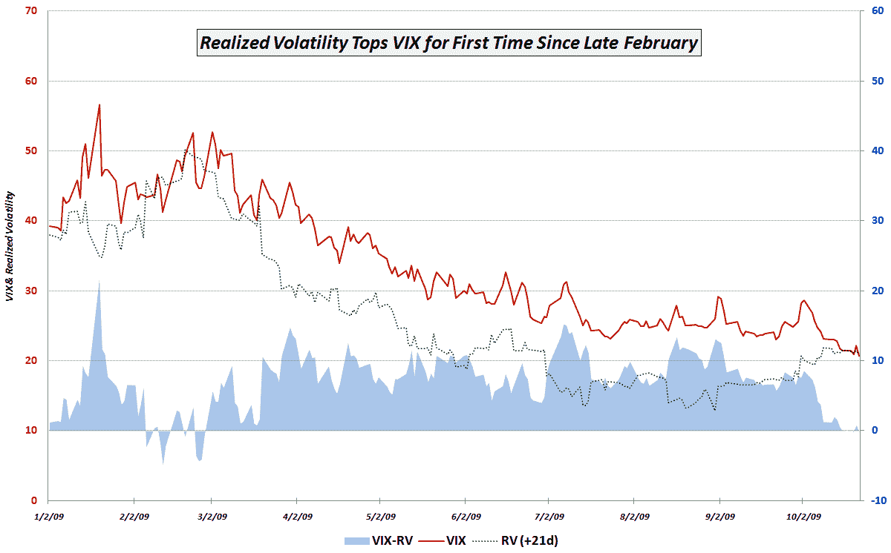

<!--yml

分类：未分类

日期：2024-05-18 17:22:22

-->

# VIX and More: Chart of the Week: No More Free Lunch for Volatility Sellers?

> 来源：[`vixandmore.blogspot.com/2009/11/chart-of-week-no-more-free-lunch-for.html#0001-01-01`](http://vixandmore.blogspot.com/2009/11/chart-of-week-no-more-free-lunch-for.html#0001-01-01)

一个月前，VIX 收于 2009 年纪录低点 20.69，因此过去一个月实际波动率高于 VIX 预测的水平并不令人惊讶。我对这一发展感到有趣的是，上周是自 2 月 27 日（市场触底前一周）以来，首次 21 天实际波动率高于 VIX 预测的波动率。

这意味着什么？

在下面的[本周图表](http://vixandmore.blogspot.com/search/label/chart%20of%20the%20week)中，我展示了自年初以来 VIX 和 21 天后的实际波动率之间的关系。需要强调的关键点是，自 2009 年以来（实际上回溯到 2008 年 11 月 20 日），在除了 2 月份的 9 个交易日之外，VIX 一直预测接下来 21 个交易日内会出现更高的波动率——直到上周。上周一、三、五，九个月的连续上涨势头被打破，因为 21 天实际波动率超过了 30 天前的 VIX。

虽然人们可能会就 VIX 和实际波动率预测市场方向的能力展开争论（在我看来，它是一个相当成功的指标，但离完美还差得远），但没有人会否认，自从 3 月份股市触底以来一直在卖波动并轻松获利的那些人现在发现，曾经提供如此可靠利润的“波动率差距”已经不再存在。

今后，我认为应该关注 VIX 和实际波动率之间的差距，以获取市场方向的线索，但更重要的是，它应该提供是否还有机会轻松获利卖波动的线索——从而窥视期权交易员的心态。

对于相关主题的额外文章，读者可以查看：

