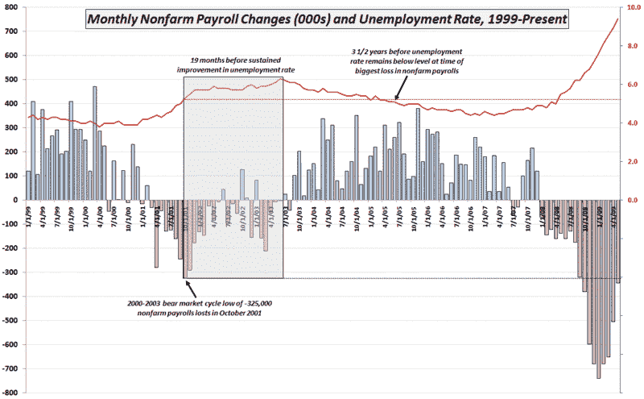

<!--yml

category: 未分类

date: 2024-05-18 17:44:14

-->

# VIX and More：本周图表：非农业工资、失业率和时间

> 来源：[`vixandmore.blogspot.com/2009/06/chart-of-week-nonfarm-payrolls.html#0001-01-01`](http://vixandmore.blogspot.com/2009/06/chart-of-week-nonfarm-payrolls.html#0001-01-01)

尽管我喜欢技术分析和情绪图表，但现在是时候让[本周图表](http://vixandmore.blogspot.com/search/label/chart%20of%20the%20week)讨论目前正在争论的许多基本宏观经济问题了。

本周的图表结合了来自[周五的就业报告](http://www.bls.gov/news.release/empsit.nr0.htm)中的两个重要就业数据：[非农业工资就业](http://vixandmore.blogspot.com/search/label/nonfarm%20payrolls)的月度变化和[失业率](http://vixandmore.blogspot.com/search/label/unemployment%20rate)。在某些方面，本周的数据似乎相互矛盾，因为非农业工资就业数据不如预期糟糕，但失业率却比预期更糟。部分原因是这些数据来自于两个不同的来源。非农业工资就业是企业调查的结果，而失业率数字是基于家庭调查计算出来的。

*在不偏离手头的主题的同时，我想强调一个经常被忽视的非农业工资组成部分，即所谓的[出生/死亡模型](http://vixandmore.blogspot.com/search/label/birth%2Fdeath%20model)。这一统计构造为调查结果增加了 22 万个工作岗位，其中大多数来自建筑、酒店和休闲部门。我对出生/死亡模型对五月数据的调整持怀疑态度，但将把这个主题留待另一篇文章。与此同时，那些有兴趣了解我所指的内容的人可能希望查阅：*

下图追溯到 1999 年，记录了 2000-2003 年经济放缓和熊市的完整历史。请注意，非农业工资最大月度下降（虚线黑线）发生在 2001 年 10 月，当时损失了 32.5 万个工作岗位。阴影灰色区域突出显示了接下来的 19 个月内失业率下降，但失业率在这段时间内从 5.3%上升到 6.3%，这被称为失业率上升但没有新增工作的复苏。如图所示，在失业率能够降至并保持在 2001 年 10 月 5.3%水平（虚线红线）以下之前，整整三年半时间已经过去。更糟糕的是，即使是 2009 年 5 月数据的显著改善，也使得失业率高于 2002-2003 年的峰值。简而言之，就业情况并没有好转，但恶化速度已经放缓。

我没有理由相信这次的衰退恢复会比上一次的快。相反，对于更长时间、更深层次的衰退的论点似乎很有说服力。即使我们这次有与上次相似的就业恢复，投资者也许需要考虑 3-4 年，或者可能更长的时间，失业率才会从 1 月失业高峰的 741,000 下降到 7.6%的水平。

数据来源：[美国劳工统计局](https://www.bls.gov/)
