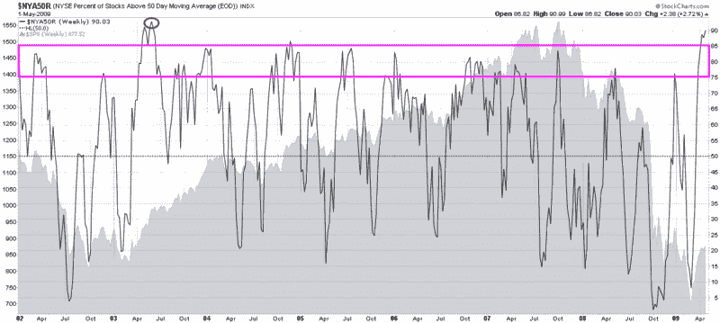

<!--yml

类别：未分类

日期：2024 年 05 月 18 日 17:49:14

-->

# VIX and More：本周图表：NYSE 股票 50 日 SMA 以上的百分比

> 来源：[`vixandmore.blogspot.com/2009/05/chart-of-week-percentage-of-nyse-stocks.html#0001-01-01`](http://vixandmore.blogspot.com/2009/05/chart-of-week-percentage-of-nyse-stocks.html#0001-01-01)

本周的[图表](http://vixandmore.blogspot.com/search/label/chart%20of%20the%20week)与其前任有些不同。下面的图表是一张跟踪目前股票交易在它们的 50 日简单移动平均线上的百分比的周线图。这些数据可以追溯到 2002 年，并显示出唯一一次百分比超过 90 的情况发生在 2003 年，当时市场正从 2002-03 年的底部反弹。

大多数情况下，股票在它们的 50 日 SMA 上方的百分比往往会在 75-85 范围内达到顶峰，然后进行校正，而保持在 20-25 以上的校正则代表着极佳的买入机会。另一方面，跌破 20-25 范围的校正则更有可能转变为较长期的熊市趋势。

在当前 90.03%的 50 日 SMA 上方的水平上，两个月的涨势必须被认为是过分的，但不一定没有额外的上升空间。考虑到 2007-09 年的大幅下跌，这样的牛市极端情况在随后的反弹中出现不应该令人感到意外，但它们应该使得牛市的参与者更加谨慎。

*[来源：StockCharts]*
