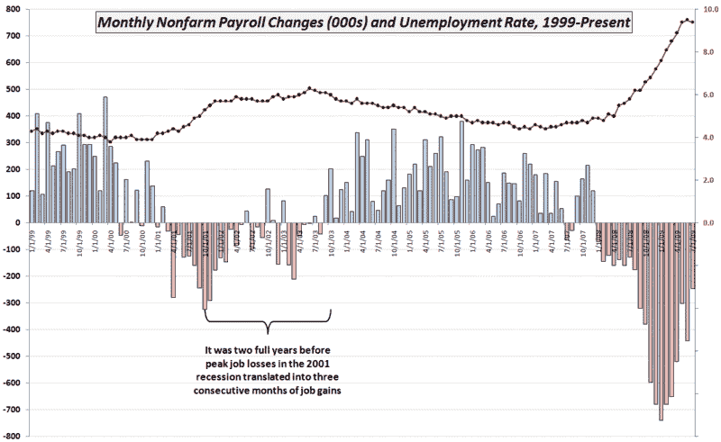

<!--yml

category: 未分类

日期：2024-05-18 17:34:43

-->

# VIX and More: 图表周报：将非农就业人数置于语境中

> 来源：[`vixandmore.blogspot.com/2009/08/chart-of-week-putting-nonfarm-payrolls.html#0001-01-01`](http://vixandmore.blogspot.com/2009/08/chart-of-week-putting-nonfarm-payrolls.html#0001-01-01)

为了经济和国民心态，我和其他人一样高兴地听说上周五的[非农就业人数](http://vixandmore.blogspot.com/search/label/nonfarm%20payrolls)~~更好~~（实际上）没有预期的那么糟。

7 月份流失的 247,000 个工作岗位是自 2008 年 8 月以来最低的，并且比 11 月至 4 月每个月遭受的失业人数少了一半还多。

我上一次突出非农就业人数是在两个多月前的[图表周报](http://vixandmore.blogspot.com/search/label/chart%20of%20the%20week)：[图表周报：非农就业人数、失业率和时间](http://vixandmore.blogspot.com/2009/06/chart-of-week-nonfarm-payrolls.html)。在那篇文章和附带的图表中，我强调在 2001 年 10 月峰值失业 32.5 万之后，19 个月后才出现了[失业率](http://vixandmore.blogspot.com/search/label/unemployment%20rate)的持续改善，而要使失业率在 2001 年 10 月的基础上持续下降，则花了整整 3 年半的时间。

这周的图表在之前的基础上增加了两个月的数据，并突出了关于月度就业报告的另一重要点。在上一场经济衰退中，从峰值失业到连续三个月的净增就业岗位，耗时两年。此外，尽管 7 月份 24.7 万的失业人数在近期就业形势看来是相当大的进步，但 2000 年至 2003 年熊市期间，7 月份将是就业流失第三糟糕的月份。

所以尽管 7 月份的就业数字无疑是朝着正确方向迈出的一步，但我们离应该庆祝的数据类型还相差甚远。

*[数据来源：美国劳工统计局]*
