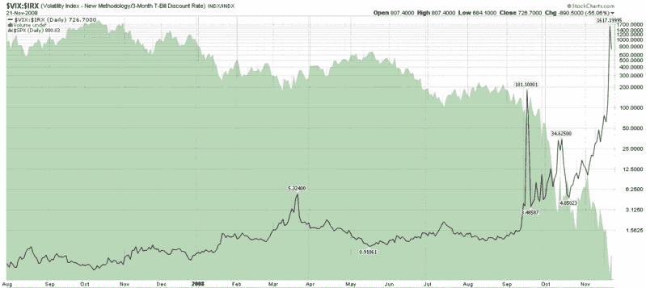

<!--yml

分类：未分类

日期：2024-05-18 18:14:44

-->

# VIX and More: 图表一周：VIX 与 3 个月期国债收益率比率

> 来源：[`vixandmore.blogspot.com/2008/11/chart-of-week-ratio-of-vix-to-yield-on.html#0001-01-01`](http://vixandmore.blogspot.com/2008/11/chart-of-week-ratio-of-vix-to-yield-on.html#0001-01-01)

我一直考虑博客上新的功能想法（欢迎在下面的评论中提出您的建议），其中一个是每周推出[图表](http://vixandmore.blogspot.com/search/label/chart%20of%20the%20week)，突出我认为过去一周特别显著的发展。当然，本周由于一些历史性的市场活动，有很多可能性可以借鉴，比如周五的[花旗集团隐含波动率图表](http://vixandmore.blogspot.com/2008/11/international-securities-exchange.html)就是一个例子。

然而，本周我想突出最近对安全投资的追求中的 T-Bill 方面，即 VIX 与[3 个月 T-bill](http://vixandmore.blogspot.com/search/label/3%20Month%20Treasury%20Bill)收益率的比率。以下是[VIX:IRX 比率](http://vixandmore.blogspot.com/search/label/VIX%3AIRX)的图表。

一些读者可能还记得，在雷曼兄弟于九月中旬破产后，我曾在图表中突出显示了同样的比率，该图表一直回溯到 1990 年，见[波动性灾难图表](http://vixandmore.blogspot.com/2008/09/volatility-catastrophe-graphic.html)。当时，VIX:IRX 比率刚刚超过 100，打破了三月份创下的历史新高，当时比率在贝尔斯登破产后跃升至 5.3。本周该比率又实现了质的飞跃，一度超过 1600，收盘价为 726。

当涉及到衡量[恐慌](http://vixandmore.blogspot.com/search/label/fear)时，VIX 只是故事的一部分。VIX:IRX 比率描绘了恐慌和对安全投资的更大范围——以及更黑暗的画面。

来源：[StockCharts]
