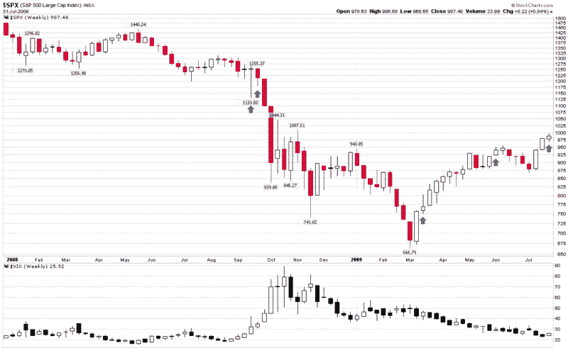

<!--

类别：未分类

日期：2024-05-18 17:35:43

-->

# VIX 和更多：本周图表：近期上升的 VIX 和 SPX

> 来源：[`vixandmore.blogspot.com/2009/08/chart-of-week-recent-rising-weekly-vix.html#0001-01-01`](http://vixandmore.blogspot.com/2009/08/chart-of-week-recent-rising-weekly-vix.html#0001-01-01)

由于周五的[VIX 是否被操纵？](http://vixandmore.blogspot.com/2009/07/is-vix-being-gamed.html)引起了广泛关注，我认为这可能是一个讨论本周[图表](http://vixandmore.blogspot.com/search/label/chart%20of%20the%20week)的好时机，该图表将探讨一个相关主题：VIX 和 SPX 同时上升的意义。最近我听到许多观察者评论说，VIX 和 SPX 之间最近的同向变动——特别是两个指数的同时上升——对股市是个不祥之兆。

坦白说，[SPX:VIX 相关性](http://vixandmore.blogspot.com/search/label/SPX-VIX%20correlation)是我自从博客早期就开始撰写的话题，关于这个主题的一些更有纪念意义的帖子包括在下面的链接中。到目前为止，我在 VIX 和 SPX 的周相关数据方面发表的内容非常少，但从这篇帖子开始，情况即将改变。

下面的图表显示了自 2008 年初以来 SPX 和 VIX 的周 K 线。自 2008 年以来，有五次 SPX 和 VIX 在同一周内上涨的情况（根据历史标准，这个数字相对较低，主要因为在这段时间内，大多数周的 SPX 都出现了下跌。）图表上的所有五次实例都用蓝色箭头标记了。

虽然五次的实例还远远不足以得出任何有意义的统计推断，但我认为有趣的是，在 2008 年 9 月至 11 月的大幅下跌之前，SPX 和 VIX 连续两周都有所上涨。另一方面，在 2009 年 3 月中旬，正当 2009 年 3 月至 7 月的反弹势头积蓄时，SPX 和 VIX 都出现了上涨。最后，2009 年 6 月初的蓝色箭头似乎落在了近期股市历史中相对平静的时期。

底线是：不要过分解读 SPX 和 VIX 同周上涨的情况。

有关这个主题的更多帖子，读者可能希望查阅：

**

*[来源：StockCharts]*

**披露**：撰写本文时持有 VIX。*
