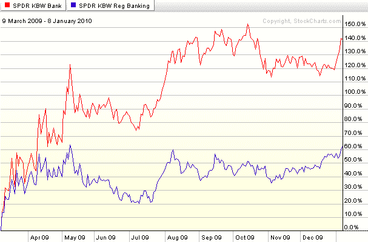

<!--yml

category: 未分类

date: 2024-05-18 17:17:55

-->

# VIX and More: Chart of the Week: Regional Banks Rising?

> 来源：[`vixandmore.blogspot.com/2010/01/chart-of-week-regional-banks-rising.html#0001-01-01`](http://vixandmore.blogspot.com/2010/01/chart-of-week-regional-banks-rising.html#0001-01-01)

2010 年我有的一大堆指标将用来了解经济和股市的表现。我选择在本周的[图表](http://vixandmore.blogspot.com/search/label/chart%20of%20the%20week)中分析的区域银行([KRE](http://vixandmore.blogspot.com/search/label/KRE))相对于整个银行业([KBE](http://vixandmore.blogspot.com/search/label/KBE))的表现。

这个逻辑相当简单。虽然在过去的一年左右的时间里，中心银行从各种与危机相关的政府项目和政策中获益不成比例，但区域银行大部分时间都是自力更生。投资假设是，最终区域银行的命运将是经济复苏广度、商业房地产市场健康状况以及小企业和地方经济复苏和增长能力的更好晴雨表。

下面的图表显示，从三月份的低点至十月初，区域银行明显落后于银行业整体，但在过去两个月左右的时间里，区域银行相对于缓慢增长的银行业有显著的复苏，并且目前它们的一年内最高点要比整个银行业指数更接近。区域银行仍面临许多挑战，但它们的表现相对于中心银行和整个银行业应该继续提供一个准确反映全国各地地方经济健康状况的图景——这个图景受到来自华盛顿的政策和立法影响的可能性更小。

有关相关主题的更多信息，读者们可以查阅：

*[来源：StockCharts]*

***披露***：撰写本文时持有 KBE*
