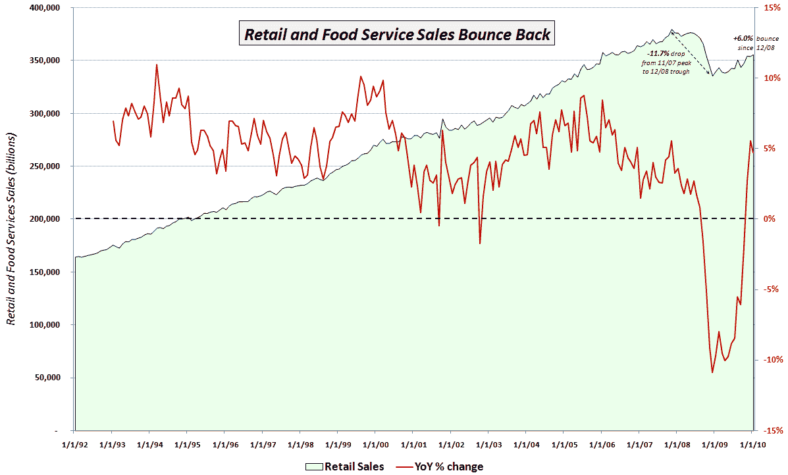

<!--yml

类别：未分类

日期：2024-05-18 17:15:25

-->

# VIX and More: Chart of the Week: Retail Sales Recovering

> 来源：[`vixandmore.blogspot.com/2010/02/chart-of-week-retail-sales-recovering.html#0001-01-01`](http://vixandmore.blogspot.com/2010/02/chart-of-week-retail-sales-recovering.html#0001-01-01)

上周所有人的注意力似乎都集中在欧洲，投资者似乎 largely ignored the new economic data coming out of the United States.

我认为最重要的经济数据显示，1 月的[零售销售](http://vixandmore.blogspot.com/search/label/retail%20sales)报告，零售销售月环比增长 0.5%（共识预测+0.3%），同比增长 4.7%。

下面的[本周图表](http://vixandmore.blogspot.com/search/label/chart%20of%20the%20week)试图将最近的零售销售数据放入有意义的的历史背景中。由于媒体通常只报道美国人口普查局[Census Bureau](http://www.census.gov/cgi-bin/briefroom/BriefRm)新闻稿中的月环比变化，我想添加几个自己的小创意。首先，下面的绿色区域数据系列捕捉了自 1992 年以来的零售和服务销售总量。注意，直到 2009 年初，零售销售从未有过持续的下滑。红色线条叠加在零售销售的年同比百分比变化上。鉴于历史上相对较浅的下滑，在 2008 年之前，这个数字从未只有两次为负：一次是 2001 年；第二次是 2002 年。

从 2008 年 9 月开始，零售销售的年同比变化连续 14 个月为负。这个势头在 2009 年 11 月终于被打破，但在 12 月零售销售再次下滑时，人们开始担忧零售销售的反弹是否能够持续。1 月的积极表现至少暂时缓解了一些担忧，并吸引了新的买家进入零售领域，其中两大 800 磅重的 gorilla ETFs ([XRT](http://vixandmore.blogspot.com/search/label/XRT) and [XLY](http://vixandmore.blogspot.com/search/label/XLY)) 看到了新的关注。

图表还注明了从 2007 年 10 月的高点到 2008 年 12 月的周期低点，零售销售下降了 11.7%。自低点以来，零售销售反弹了 6.0%或 2.7%。在零售销售恢复到 2007 年 10 月的高点之前，可能还需要一年或两年，但到目前为止，消费者的韧性远比许多评论家预期的要强。

For more on related subjects, readers are encouraged to check out: 

*[source: Federal Reserve Bank of St. Louis]*  ***Disclosures:*** *none*
