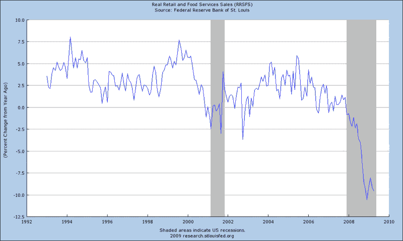

<!--yml

category: 未分类

date: 2024-05-18 17:47:25

-->

# VIX and More: 本周图表：零售销售

> 来源：[`vixandmore.blogspot.com/2009/05/chart-of-week-retail-sales.html#0001-01-01`](http://vixandmore.blogspot.com/2009/05/chart-of-week-retail-sales.html#0001-01-01)

我通常会确保本周的[图表](http://vixandmore.blogspot.com/search/label/chart%20of%20the%20week)是解决了我认为值得深入讨论的话题，或者以新的视角呈现了一些新材料。

由于我近五天来一直不在状态，其他人可能在我不在的这段时间里已经把[零售销售](http://vixandmore.blogspot.com/search/label/retail%20sales)这个话题讨论得十分透彻。即使如此，我也没有问题，因为我相信四月份的零售销售数据是本周图表的缩影，可以代表更广泛的经济形势。简而言之，零售销售数据提醒我们，虽然从三月份开始情况有所改善，但总体上，经济仍然像过去三十年，甚至更长时间以来一样疲弱。

下面的图表显示了零售销售同比增长百分比。情况是否有显著改善，还是我们只是开始触底反弹？看来至少需要另外 2-3 个月的数据，我们才能正确回答这个问题。

*[来源：圣路易斯联邦储备银行]*
