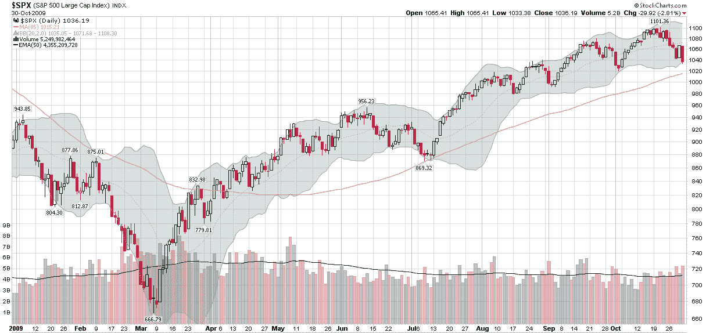

<!--yml

分类：未分类

日期：2024-05-18 17:23:55

-->

# VIX 和更多：本周图表：逆向工程关键移动平均线

> 来源：[`vixandmore.blogspot.com/2009/11/chart-of-week-reverse-engineering.html#0001-01-01`](http://vixandmore.blogspot.com/2009/11/chart-of-week-reverse-engineering.html#0001-01-01)

这周的[本周图表](http://vixandmore.blogspot.com/search/label/chart%20of%20the%20week)简单提醒我们，虽然我们中的许多人喜欢标准化 20、50 和 200 天的移动平均线，但这些很少总是与历史数据完美对齐。实际上，开发自定义的移动平均线，以框定过去的价格行动，以便更好地了解当前对股价施加的力量与过去的力量相比如何。

其中一个例子就在下面的图表中。常用的移动平均线未能从 7 月份的 SPX 低点 869 中识别出支撑水平。当这种情况发生时，稍微尝试和错误可以很快确定哪个移动平均线对基础资产提供了支撑。在这种情况下，是 85 天的移动平均线起了作用。虽然我并不是说 85 天移动平均线是解决所有图表问题的答案，但如果当前市场下行穿透了 85 天移动平均线，这将是一次与或比 7 月份回调更强烈的行动。

有时数据优化可能是一个危险的游戏，但当涉及到移动平均线和图表时，优化可以发挥有益的作用。

来源：[StockCharts]
