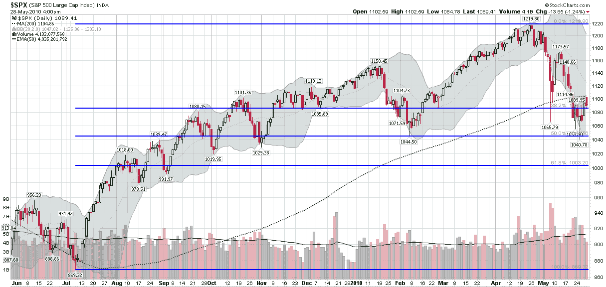

<!--yml

分类：未分类

日期：2024-05-18 17:09:21

-->

# VIX 和更多：本周图表：SPX、斐波那契和 200 日移动平均线

> 来源：[`vixandmore.blogspot.com/2010/06/chart-of-week-spx-fibs-and-200-day-ma.html#0001-01-01`](http://vixandmore.blogspot.com/2010/06/chart-of-week-spx-fibs-and-200-day-ma.html#0001-01-01)

这周的[本周图表](http://vixandmore.blogspot.com/search/label/chart%20of%20the%20week)试图提供一些相对简单且不杂乱的东西：对标普 500 指数的一年期观察。

下面的图表显示了 SPX 的日线柱状图，带有四个高亮的叠加：

1.  200 日移动平均线（虚线绿色）——目前位于 1105，每周上升约两点，可能构成潜在的上行阻力

1.  [斐波那契](http://vixandmore.blogspot.com/search/label/Fibonacci)回撤水平从 2009 年 7 月的低点 869 到 2010 年 4 月的高点 1219 绘制——这些产生了 50%的回撤水平 1044（最近的支撑）和 38.2%的回撤水平 1085（目前略低于当前水平）

1.  成交量，包括 50 日移动平均线（实线绿色）——显示 5 月份活动显著增加

1.  布林带（基于 20 天和 2 个标准差的灰色云朵）

除了指出 200 日移动平均线和斐波那契回撤水平（特别是当前的 1085）看起来是重要的防线外，我将把其余的结论留给读者。

*[来源：StockCharts.com]*

***披露：*** *无*
