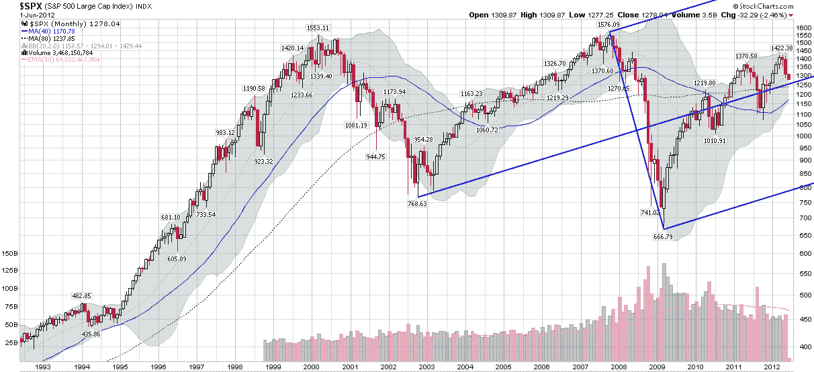

<!--yml

分类：未分类

日期：2024-05-18 16:28:52

-->

# VIX and More: 图表一周：SPX 安德鲁斯叉线

> 来源：[`vixandmore.blogspot.com/2012/06/chart-of-week-spx-andrews-pitchfork.html#0001-01-01`](http://vixandmore.blogspot.com/2012/06/chart-of-week-spx-andrews-pitchfork.html#0001-01-01)

周末，投资者们的头脑中充满了“转折点”和“财政悬崖”等词汇，他们为股市今天设定了许多极端情景，但大部分情况下，围绕不变线波动并不被认为是可能的 outcome. Yet, 1 ½ hours into today’s session, stocks are essentially flat.

我提到这一切是因为如果一个人看过去 20 年的月度[安德鲁斯叉线](http://vixandmore.blogspot.com/search/label/Andrews%20Pitchfork)图，股票在过去 2 ½年左右的走势看起来非常普通，股票紧贴叉线的中心枝，目前指向 SPX 的大约 1265 点的“公平价值”趋势线。

我发布下面图表的部分原因在于，它显示了股票近期走势中惊人的温和程度和[均值回归](http://vixandmore.blogspot.com/search/label/mean%20reversion)现象。我试图将安德鲁斯叉线图纳入讨论中的另一个原因是在我上次两次发布这些图表时，收到的读者反馈非常强烈，表明第一次看到这些图表的人对这些图表的视觉简洁性和潜在逻辑非常感兴趣。展望未来，如果这张安德鲁斯叉线图能够帮助定义股票的通道和均值回归目标，它将提供一些真正的价值。鉴于当前存在如此多的宏观经济不确定性，如果技术工具箱中的某物能够为投资者提供将波动性和方向性元素结合在一起的有意义背景，那将是一件好事。

关于安德鲁斯叉线图的更多信息，请查看下面的两个链接。

相关文章：

来源：[StockCharts.com]

***披露：*** *无*
