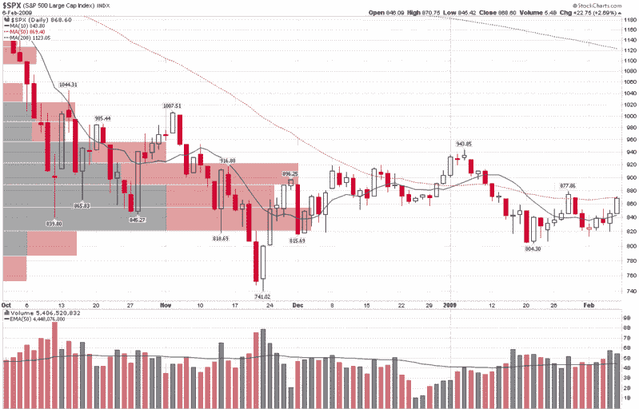

<!--yml

类别：未分类

日期：2024-05-18 18:01:16

-->

# VIX 和更多：本周图表：标普 500 价格成交量

> 来源：[`vixandmore.blogspot.com/2009/02/chart-of-week-spx-price-by-volume.html#0001-01-01`](http://vixandmore.blogspot.com/2009/02/chart-of-week-spx-price-by-volume.html#0001-01-01)

技术人员有许多方法可以帮助确定各种市场动作可能遇到的重要支撑和阻力。移动平均线是一种常见方法，枢轴点是另一种，而[斐波那契](http://vixandmore.blogspot.com/search/label/Fibonacci)回撤水平是我个人最喜欢的一种。

衡量支撑和阻力的另一种方法涉及使用图表来[显示价格和成交量](http://vixandmore.blogspot.com/search/label/price%20by%20volume)。由于我最近很少听到有关价格和成交量图表的消息，这似乎是一个很好的时机，让这些图表成为本周[图表周](http://vixandmore.blogspot.com/search/label/chart%20of%20the%20week)的主题。

在下面的图表中，除了标准每日成交量的垂直柱状图外，我还使用了一个 StockCharts 工具来绘制代表收盘价落在每个水平价格和成交量柱状图描述范围内的所有日子的总成交量的水平柱状图。柱状图越长，那个价格范围内成交的量就越大。为了进行更详细的分析，我还对价格和成交量柱状图进行了颜色编码，这样就可以进一步将每个价格和成交量范围内的总成交量分解为上涨成交量（灰色）和下跌成交量（红色）。

就时间框架而言，我使用了从 2008 年 10 月初开始的标普 500 数据来说明可能的阻力。注意，在这 18 周的时间里，大部分成交量集中在约 820-920 的范围。

目前标普 500 指数仅比其 50 日均线（虚红线）低一个点，因此可能很难有额外的上涨。然而，根据价格和成交量图表，最大的阻力应该在 890-920 区域，不仅这个价格和成交量的柱状图很长，而且由于之前的卖压，它主要是红色的。

如果标普 500 指数能够突破 920 点，那么根据柱状图的长度和红灰面积的比例，阻力似乎会大幅下降，955 点在回到 1000 点的路上看起来不再是一个难以逾越的障碍。

当然，图表们不知道盖特纳周一将要说些什么，也不知道众议院和参议院将如何解决他们对经济刺激计划中需要包含哪些内容的不同看法。

**[来源：StockCharts]**
