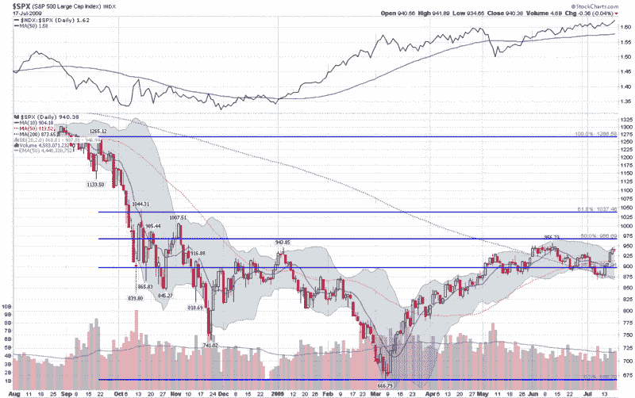

<!--yml

category: 未分类

date: 2024-05-18 17:37:57

-->

# VIX 和更多：本周图表：SPX 和 NDX

> 来源：[`vixandmore.blogspot.com/2009/07/chart-of-week-spx-and-ndx.html#0001-01-01`](http://vixandmore.blogspot.com/2009/07/chart-of-week-spx-and-ndx.html#0001-01-01)

在回顾以往的[本周图表](http://vixandmore.blogspot.com/search/label/chart%20of%20the%20week)图表时，我惊讶地发现，在过去五个月里，我只展示过一次 SPX 的图表([本周图表：成交量和广度缺乏威胁牛市行情](http://vixandmore.blogspot.com/2009/06/chart-of-week-lack-of-volume-and.html))，决定这个最重要的指数需要更频繁地成为焦点。

唉，本周的图表显示了一年的 SPX 日线柱状图，包括一些标准的移动平均线和[布林带](http://vixandmore.blogspot.com/search/label/Bollinger%20bands)，以及一组过去曾引发大量讨论的斐波那契回撤线([SPX 和斐波那契阻力 966](http://vixandmore.blogspot.com/search/label/Bollinger%20bands))。这个图表的新变化是纳指 100([NDX](http://vixandmore.blogspot.com/search/label/NDX))对 SPX 的简单比率，作为主要图表上方的一个研究。([NDX:SPX 比率](http://vixandmore.blogspot.com/search/label/NDX%3ASPX))显示，尽管 SPX 从 6 月 12 日的高点回撤，但在相对基础上，NDX 的表现优于 SPX，这种情况在过去两个月一直如此。受到英特尔([INTC](http://vixandmore.blogspot.com/search/label/INTC))非常强劲的财报的推动，NDX:SPX 比率目前达到了 2001 年初以来的最高水平，而 NDX 现在轻松地超过了 6 月的高点。

值得注意的是，除了科技股外，唯一一个超过 6 月高点的主要板块是医疗保健([XLV](http://vixandmore.blogspot.com/search/label/XLV))，而消费品必需品([XLP](http://vixandmore.blogspot.com/search/label/XLP))仅比那个最高点低 0.03。考虑到科技股的领导地位对多方来说是一个积极的信号，防御性板块如医疗保健和消费品必需品的高相对强度可能被视为一个警告信号。

有关先前的本周图表文章，请参阅：[本周图表：卷土重来的纳指 100](http://vixandmore.blogspot.com/2009/04/chart-of-week-resurgent-nasdaq-100.html) (4/5/2009)

*[图表：StockCharts]*
