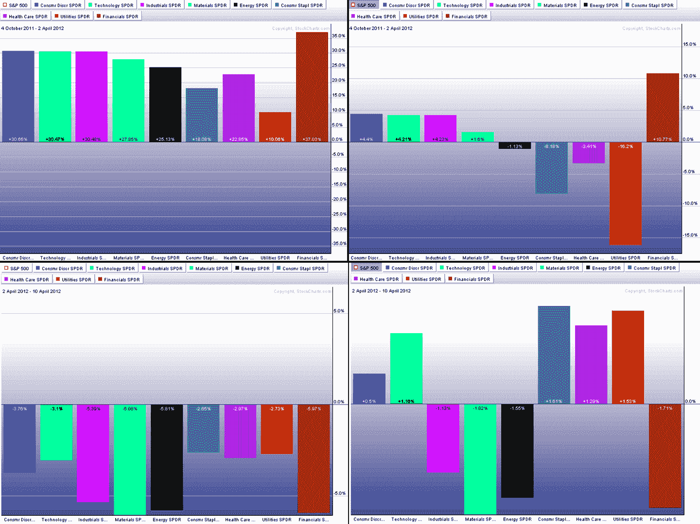

<!--yml

category: 未分类

date: 2024-05-18 16:31:30

-->

# VIX and More: Chart of the Week: Sector Winners and Losers

> 来源：[`vixandmore.blogspot.com/2012/04/chart-of-week-sector-winners-and-losers.html#0001-01-01`](http://vixandmore.blogspot.com/2012/04/chart-of-week-sector-winners-and-losers.html#0001-01-01)

虽然在 10 月到 4 月的反弹以及月初的回调期间，[板块](http://vixandmore.blogspot.com/search/label/sectors)领域有很多事情发生，但我还没有看到关于这两个时期发生任何事情的详细解释。

本周以下[图表](http://vixandmore.blogspot.com/search/label/chart%20of%20the%20week)试图填补这一空白，通过比较 2011 年 10 月 4 日至 2012 年 4 月 2 日的牛市以及 2012 年 4 月 2 日至 4 月 10 日的熊市回调的四张图表。上面两张图表涵盖牛市，左图捕捉绝对板块表现，右图捕捉板块相对于标普 500 指数整体变化的表现。下面两张图表也有绝对板块表现和相对板块表现，但这次是在 4 月 2 日至 10 日的回调期间。

绝对数据显示，在牛市期间所有板块都上涨，在熊市期间都下跌。相对数据显示，金融股（[XLF](http://vixandmore.blogspot.com/search/label/XLF)）是牛市的主要动力，也是回调的最大贡献者。虽然金融股与消费品 discretionary 股票（[XLY](http://vixandmore.blogspot.com/search/label/XLY)）、工业股（[XLI](http://vixandmore.blogspot.com/search/label/XLI)）和科技股（[XLK](http://vixandmore.blogspot.com/search/label/XLK)）在上涨过程中共享了一些荣誉，但材料股（[XLB](http://vixandmore.blogspot.com/search/label/XLB)）、能源股（[XLE](http://vixandmore.blogspot.com/search/label/XLE)）和工业股是导致大盘下跌的主要因素。只有两个板块在上涨和下跌过程中表现优于标普 500 指数：科技股和消费品 discretionary 股票。相反，能源股在两个方向上都是表现最差的。

虽然这些图表中没有体现，但从 4 月 10 日触底以来的三周里，消费品 discretionary、材料和工业股是上涨势头最大的贡献者。有趣的是，科技股目前已转为成为表现最差的拖累。

有人可能会很有说服力地提出，标普 500 指数能否冲向 1500 点（[詹姆斯·阿尔特彻尔，请接受我们的敬意](http://www.marketwatch.com/video/asset/7-reasons-the-sp-500-should-hit-1500/415ADC1B-4D66-461F-9F20-CA597CE4165C)）在很大程度上将取决于科技股是否能回归领导地位。

*相关文章：

**

*[source(s): StockCharts.com]*

**披露声明：** *在撰写本文时，作者持有大量 XLY 股票*
