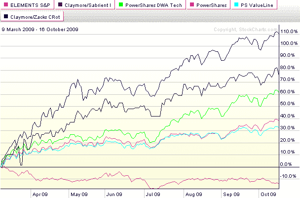

<!--yml

类别：未分类

日期：2024-05-18 17:26:08

-->

# VIX and More: 图表一周：策略-in-a-Box ETFs

> 来源：[`vixandmore.blogspot.com/2009/10/chart-of-week-strategy-in-box-etfs.html#0001-01-01`](http://vixandmore.blogspot.com/2009/10/chart-of-week-strategy-in-box-etfs.html#0001-01-01)

随着对主动管理 ETF 兴趣的增加，我认为大多数投资者不公平地忽视了另一种 ETF（和 ETN）类别。我没有给这些 ETF 起名字，它们不是代表资产类别、部门、地理区域和其他典型的 ETF 构架，而是试图复制特定的投资策略。在有人为它们想出更好的名字之前，我将称它们为[策略-in-a-box ETFs](http://vixandmore.blogspot.com/search/label/Strategy-in-a-Box%20ETFs)。

取决于您如何定义“策略-in-a-box”概念，您能找到各种可能符合或不符合该定义的 ETF，但其中有六个明确符合这一轮廓，吸引了部分投资者兴趣，并且我试图进行监测的是：

+   Elements S&P CTI ETN ([LSC](http://vixandmore.blogspot.com/search/label/LSC)) – 一种长短商品技术动量 ETF

+   Claymore/Sabrient Insider ETF ([NFO](http://vixandmore.blogspot.com/search/label/NFO)) – 关注于那些存在有利于公司内部人士购买趋势以及华尔街分析师近期盈利预测上调公司的 ETF

+   PowerShares DWA Technical Leaders ([PDP](http://vixandmore.blogspot.com/search/label/PDP)) – 专注于展示出强劲相对强度公司的 Dorsey Wright & Associates 技术领导者指数

+   PowerShares Value Line Industry Rotation ([PYH](http://vixandmore.blogspot.com/search/label/PYH)) – 基于 Value Line 行业轮动指数，该指数来源于 Value Line 对股票时效性和行业时效性的衡量

+   PowerShares Value Line Timeliness Select ([PIV](http://vixandmore.blogspot.com/search/label/PIV)) – 与上述 ETF 不同，它利用了三个核心 Value Line 排名系统，这些系统包含了时效性、技术排名和安全排名

+   Claymore/Zacks 国家轮动 ([CRO](http://vixandmore.blogspot.com/search/label/CRO)) – 试图跟踪 Zacks 国家轮动指数

你能用这支 ETF 组合做些什么呢？首先，由于它们全部存在至少 15 个月（除了 LSC 都超过两年），你可以看看在这些实时牛市和熊市条件下，其中一些策略是如何运作的。例如，如果你恰好在 3 月 9 日变得看涨，上述哪些 ETF 将提供最好的回报？下方的[本周图表](http://vixandmore.blogspot.com/search/label/chart%20of%20the%20week)显示，Claymore/Sabrient Insider ETF (NFO)一直领先，在过去七个月多时间里翻了一番多。表现第二好的是 CRO，即 Claymore/Zachs Country Rotation ETF。PowerShares DWA Technical Leaders (PDP)在牛市中的回报与 SPX 相当。有趣的是，在股票强劲的牛市中，Elements S&P CTI ETN (LSC)实际上亏了钱。

我将在以后关于这些 ETF 以及它们的主动管理 ETF 同行有更多的话要说。与此同时，不妨提出一个比“策略盒子”更好的名字……

来源：[StockCharts]
