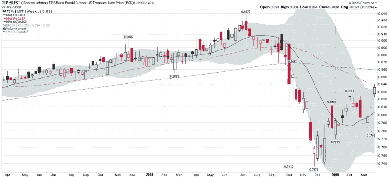

<!--yml

类别：未分类

日期：2024-05-18 17:53:54

-->

# VIX 和更多：本周图表：TIPS 突破

> 来源：[`vixandmore.blogspot.com/2009/03/chart-of-week-tips-breaking-out.html#0001-01-01`](http://vixandmore.blogspot.com/2009/03/chart-of-week-tips-breaking-out.html#0001-01-01)

虽然本周有许多重要的故事发生，但让我暂时屏住呼吸的是英国政府 40 年期国债拍卖失败，以及随后对美国 5 年期国债的需求疲软。尽管周四成功拍卖了 240 亿美元的 7 年期美国国债暂时让国债拍卖问题退居次要位置，但利率的剧情显然在 thickening —— 通缩与通胀的辩论开始升温。

对抗通胀的一个极好方法就是通过使用国债通胀保护证券，更 commonly known as [TIPS](http://vixandmore.blogspot.com/search/label/TIPS)。正如我在去年 9 月提到的[国债通胀保护证券与通胀预期](http://vixandmore.blogspot.com/2008/09/treasury-inflation-protected-securities.html)，TIPS 使用 CPI 作为通胀基准，TIPS 的票息支付和本金会自动调整以反映通胀。

所有这些都让我们来看一下下面的本周图表[TIP](http://vixandmore.blogspot.com/search/label/TIP)与[10 年期美国国债](http://vixandmore.blogspot.com/search/label/10%20Year%20Treasury%20Note)的比率，这个比率在过去六个月左右经历了几次震动，但自去年 12 月中旬以来，投资者明显偏好 TIPS 胜过标准的国债。事实上，随着上周对通胀的担忧加剧，TIP（平均到期时间约为 9 年）的表现令人印象深刻，而与之相当的国债却下跌了。这个比率现在正接近雷曼兄弟破产前的水平，因此进一步的变动可以帮助判断通胀或通缩的恐慌是否主导了投资者的思维。

*[source: StockCharts]*
