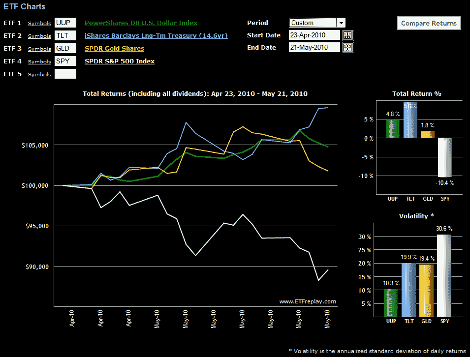

<!--yml

类别：未分类

日期：2024-05-18 17:09:53

-->

# VIX and More: 图表：避险交易

> 来源：[`vixandmore.blogspot.com/2010/05/chart-of-week-flight-to-safety-trade.html#0001-01-01`](http://vixandmore.blogspot.com/2010/05/chart-of-week-flight-to-safety-trade.html#0001-01-01)

本周的[图表](http://vixandmore.blogspot.com/search/label/chart%20of%20the%20week)将探讨投资者自 4 月 23 日以来利用标普 500 指数收盘高点 1217 的各种避险交易。

在下面的图表中，请注意，首先黄金([GLD](http://vixandmore.blogspot.com/search/label/GLD))，然后是美元([UUP](http://vixandmore.blogspot.com/search/label/UUP))，作为对冲股票下跌的工具达到了顶峰。最近，[美国国债](http://vixandmore.blogspot.com/search/label/Treasury%20Note)成为了首选的避险工具，长期债券 ETF([TLT](http://vixandmore.blogspot.com/search/label/TLT))的表现优于其他两种替代品和短期国债 ETF（如未显示的[IEF](http://vixandmore.blogspot.com/search/label/IEF)），吸引了相当多的买家。

下图中未显示的[VXX](http://vixandmore.blogspot.com/search/label/VXX)（iPath S&P 500 VIX Short-Term Futures ETN）更像是一种对冲工具，而不是一种避险替代品。在过去的一个月中，VXX 上涨了 81.3%，其波动性为 113.6。

*[来源：ETFreplay.com]*

***披露：****在撰写本文时持有 VXX 的空头头寸*
