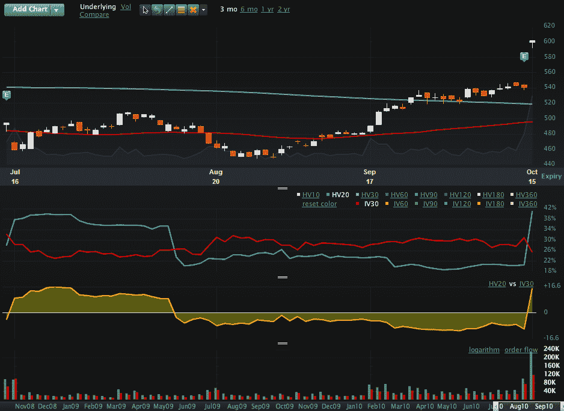

<!--yml

类别：未分类

日期：2024-05-18 17:01:05

-->

# VIX and More：本周图表：谷歌波动性故事

> 来源：[`vixandmore.blogspot.com/2010/10/chart-of-week-google-volatility-story.html#0001-01-01`](http://vixandmore.blogspot.com/2010/10/chart-of-week-google-volatility-story.html#0001-01-01)

如果有一条关于波动性的广泛接受的原则，而我妻子拒绝屈服，那就是当一支股票大幅下跌时，其[隐含波动性](http://vixandmore.blogspot.com/search/label/implied%20volatility)几乎自动增加，然而当同一支股票大幅上涨时，其隐含波动性几乎自动减少。她坚持认为，波动性应该是方向性不可知的，无论是隐含波动性还是历史波动性。

在股票的情况下，很少存在对波动性有平衡的双向看法。与对称波动性预期相关的主要原因与与极端价格波动相关的信念有关。古老的谚语“股票慢慢涨，但电梯快速下跌”在统计上得到了一定的支持，并且对于大多数交易者来说，在个人经验方面也得到了相当的确认。换句话说，当一家公司发生积极的事情时，很少会形成推动其股价飙升的良性循环。另一方面，当情况恶化时，多米诺骨牌往往会以一种让坏消息不断产生的方式排列，一些投资者因此将其称为“[蟑螂理论](http://www.investopedia.com/terms/c/cockroach-theory.asp)”，因为似乎从来就不只有一只蟑螂。

部分是由于电梯、蟑螂和个人经验的影响，大多数股票期权呈现出负波动性倾斜（也称为反向倾斜或“波动性嘲笑”），即虚值看跌期权的隐含波动率远高于虚值看涨期权。[（参考链接）](http://vixandmore.blogspot.com/search/label/skew)

本周的[图表](http://vixandmore.blogspot.com/search/label/chart%20of%20the%20week)显示了我妻子对之有异议的有趣现象。具体来说，谷歌（[GOOG](http://vixandmore.blogspot.com/search/label/GOOG)）的股价在周五强劲的盈利报告后上涨了 11%。正如下面的图表所示，历史或实现波动性大幅增加（21 天历史波动性从 21 上涨到 41），而隐含波动性急剧下降（30 天隐含波动性从 30.24 下降到 25.35）。

随着谷歌的收益问题解决，股票的立即前景显然去除了一些[事件波动性](http://vixandmore.blogspot.com/search/label/event%20volatility)，但周五股价的 60 点上涨真的使其不那么容易受到未来波动的影响吗？数据似乎是这样认为的…

相关帖子：

*[来源：Livevol Pro]*

***披露：*** *Livevol* *是 VIX and More 的广告客户*
