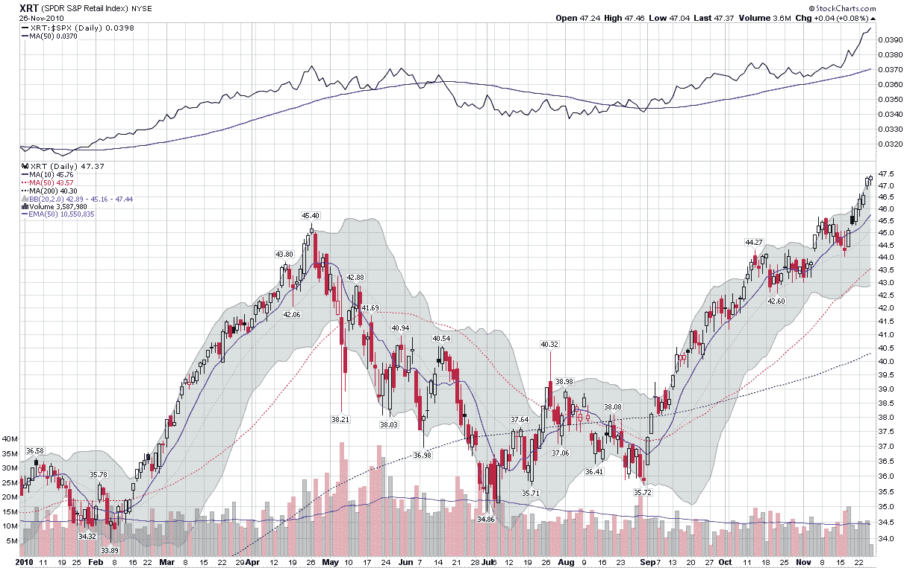

<!--yml

类别：未分类

日期：2024-05-18 16:58:00

-->

# 波动率指数与更多内容：本周图表：复苏的消费者与假日购物

> 来源：[`vixandmore.blogspot.com/2010/11/chart-of-week-resurgent-consumer-and.html#0001-01-01`](http://vixandmore.blogspot.com/2010/11/chart-of-week-resurgent-consumer-and.html#0001-01-01)

2010 年上半年，制造业的复苏帮助提升了股市。当制造业达到顶峰时，股市放弃了它们的涨幅。现在看起来制造业可能再次回升，但正是消费者支出在很大程度上推动了股市最近的增长。

有两大交易所交易基金（ETFs）专注于零售业，分别是[XLY](http://vixandmore.blogspot.com/search/label/XLY)和[XRT](http://vixandmore.blogspot.com/search/label/XRT)。虽然这两个都不是用来代表我们假期购物资金最可能竞争的商店类型的最佳代理，但它们都能抓住主要趋势。我个人倾向于稍微偏爱 XRT，因为 XRT 的持股更多，而且分布更均匀。例如，XLY 的前十大持股中包括麦当劳([MCD](http://vixandmore.blogspot.com/search/label/MCD))。

在本周的[图表](http://vixandmore.blogspot.com/search/label/chart%20of%20the%20week)中，我展示了 XRT 在 2010 年的表现。请注意，本月早些时候 XRT 突破了 4 月份的高点，并自那时以来继续维持看涨的轨迹。特别值得注意的是该板块相对于标普 500 指数的表现（顶部研究），自从 9 月初股市开始反弹以来一直非常强劲。

随着假日购物季的良好开局，XRT 成为了一个有趣的动量投资选择，并应该成为衡量美国消费者在整个假日购物季强大程度的一个晴雨表。

相关文章：

来源：[StockCharts.com]*

****披露信息：*** *无*
