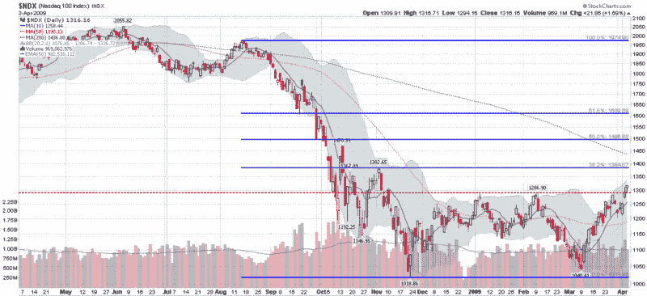

<!--yml

类别：未分类

日期：2024-05-18 17:53:04

-->

# VIX and More:本周图表：复苏的纳斯达克 100

> 来源：[`vixandmore.blogspot.com/2009/04/chart-of-week-resurgent-nasdaq-100.html#0001-01-01`](http://vixandmore.blogspot.com/2009/04/chart-of-week-resurgent-nasdaq-100.html#0001-01-01)

科技股回归，大型科技股帮助引领近期股市反弹。

即使在经历了四周的上涨之后，2009 年也 mostly 是一个红色的海洋。事实上，两个主要的指数，道琼斯工业平均指数和标普 500 指数，在 2009 年至今分别下跌了 8.65%和 6.73%。大型股和小型股的表现都不尽如人意，大型股标普 100（OEX）下跌了 8.27%，小型股罗素 2000（RUT）下跌了 8.67%。

以科技股为主的纳斯达克的故事完全不同，纳斯达克综合指数（+2.84%）和纳斯达克 100（+8.63%）都实现了上涨。

在下面的[本周图表](http://vixandmore.blogspot.com/search/label/chart%20of%20the%20week)中，我突出显示了纳斯达克 100 指数([NDX](http://vixandmore.blogspot.com/search/label/NDX))，该指数在上周五收于 11 月初以来的最高水平，原因是 Research in Motion([RIMM](http://vixandmore.blogspot.com/search/label/RIMM))发布了强劲的财报并提高了指导。NDX 是纳斯达克市值最大的 100 家公司的加权指数。因此，最大的权重看起来像是一份大型科技公司的大名单：微软([MSFT](http://vixandmore.blogspot.com/search/label/MSFT)); 谷歌([GOOG](http://vixandmore.blogspot.com/search/label/GOOG));思科([CSCO](http://vixandmore.blogspot.com/search/label/CSCO)); 苹果([AAPL](http://vixandmore.blogspot.com/search/label/AAPL)); Oracle([ORCL](http://vixandmore.blogspot.com/search/label/ORCL)); 英特尔([INTC](http://vixandmore.blogspot.com/search/label/INTC)); 高通([QCOM](http://vixandmore.blogspot.com/search/label/QCOM)); 等。

无论复苏的 NDX 是否能够继续上涨并回补 9 月和 10 月的剧烈跌幅，这在很大程度上将决定 broader 市场是否能够获得足够的动力，也以绿色结束 2009 年。

*[来源：StockCharts]*
