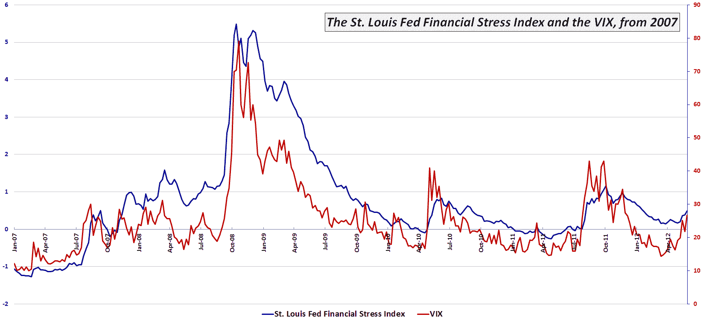

<!--yml

分类：未分类

日期：2024-05-18 16:28:19

-->

# VIX and More: 图表周报：圣路易斯联邦储备银行的金融压力指数与市场风险

> 来源：[`vixandmore.blogspot.com/2012/06/chart-of-week-st-louis-financial-stress.html#0001-01-01`](http://vixandmore.blogspot.com/2012/06/chart-of-week-st-louis-financial-stress.html#0001-01-01)

确定金融市场的[风险](http://vixandmore.blogspot.com/search/label/risk)应该随着更多数据、更多指标以及更有经验地应对危机环境而变得更容易，对吗？别急。

例如，现在，芝加哥期权交易所波动率指数（是的，VIX 确实有一个正式名称）略高于其生命周期平均值，而 10 年期美国国债收益率离历史低点只剩一周时间。确实，美联储通过[扭曲操作](http://vixandmore.blogspot.com/search/label/Operation%20Twist)和其他政策举措扭曲了利率，但只有在最近一个月左右，收益率才跌破 1.7%。

用于衡量金融市场及相关机构风险的一种广泛工具是圣路易斯联邦储备银行编制的金融压力指数（我将其称为[STLFSI](http://vixandmore.blogspot.com/search/label/STLFSI)），该指数包含[18 个构成指标](http://research.stlouisfed.org/publications/net/NETJan2010Appendix.pdf)，包括各种利率和收益率利差数据，以及 VIX、债券波动性测量和其他与市场压力相关的数据。

本周的[图表周报](http://vixandmore.blogspot.com/search/label/chart%20of%20the%20week)如下显示了自 2007 年以来 STLFSI 和 VIX 的走势。注意，2012 年的大部分时间里，VIX 显示的风险和不确定性要远低于 STLFSI。直到 5 月中旬，我观察到 VIX 相对于 STLFSI 的相对水平才有所上升。例如，上周，STLFSI 处于其生命周期范围的 79 百分位，而 VIX 处于 82 百分位。记录在案，分歧最严重的是 3 月中旬，当时 STLFSI 读数为 68 百分位，而 VIX 却处于 23 百分位。金融历史学家可能还感兴趣的是，3 月中旬的分歧是自 2008 年 8 月以来最大的...

关于 STLFSI 的构成指标和指数长期表现更多信息，请查看早期的一篇文章《圣路易斯联邦储备银行的金融压力指数](http://vixandmore.blogspot.com/2010/09/st-louis-feds-financial-stress-index.html)，以及其他一些下面链接的文章。

相关文章：

**[source(s): Federal Reserve Bank of St. Louis]**

***披露：*** *无*
