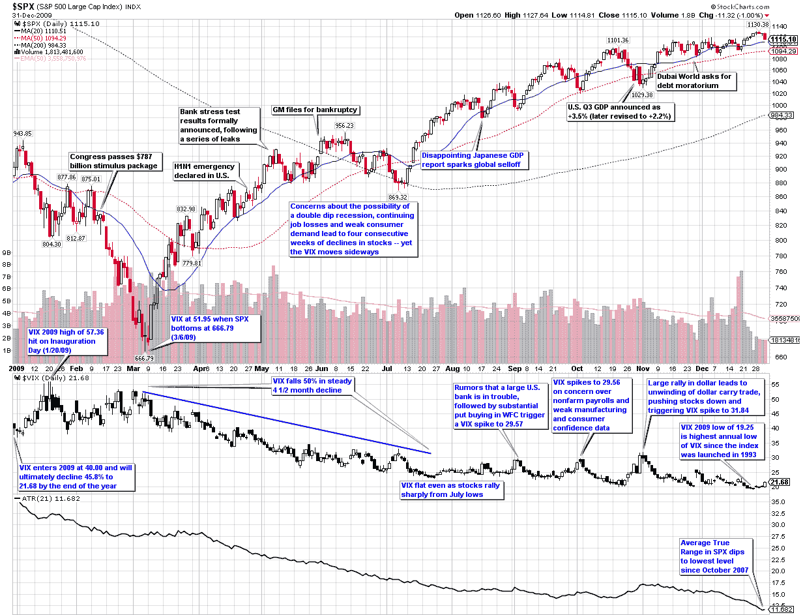

<!--yml

分类：未分类

日期：2024-05-18 17:18:30

-->

# 2009 年的 VIX 和波动性

> 来源：[`vixandmore.blogspot.com/2010/01/chart-of-week-vix-and-volatility-in.html#0001-01-01`](http://vixandmore.blogspot.com/2010/01/chart-of-week-vix-and-volatility-in.html#0001-01-01)

在本周的[图表](http://vixandmore.blogspot.com/search/label/chart%20of%20the%20week)中，我通过 VIX 和波动性的视角回顾了整个一年。这幅 heavily annotated 图表的第一个印象是，尽管今年标普 500 指数的图形看起来像一个勾号（在三月份的低点下跌后跟随一个反弹），但由 VIX 和 SPX 的平均真实范围衡量的波动性几乎在整个年度内直线下降。换句话说，2009 年波动性对市场下跌的敏感度要低于之前的几年。

同样，虽然 VIX 在 2008 年 10 月达到了 89.53 的高点，但直到五个月后，SPX 才最终触底。VIX 领先于 SPX 的平均回归部分解释可能是由于我描述在[《可用性偏见与灾难印记》](http://vixandmore.blogspot.com/2009/11/availability-bias-and-disaster.html)中的行为金融因素所导致的。

即使是在 2009 年波动性较不敏感的 VIX，全年的 VIX 平均值也达到了第二高水平（31.48，仅次于 2008 年的 32.68 的记录），并且 VIX 的年低点（19.25）也是自 1993 年 VIX 推出以来的最高水平。

该图表展示了当年波动性景观上的一些重大事件，以及其他一些对波动性影响有限的事件（黑色文本）。值得注意的是，去年下半年波动性并没有出现持续上升。相反，波动性事件短暂且除了一次例外，没有能够将 VIX 推高至 30 以上。我发现很有趣的是，尽管有关美国一家大银行遇到麻烦的传言，甚至是迪拜债务危机，都没有使 VIX 超过 30，但最终将 VIX 推高至 30 以上的事件更像是一个交易事件（美元套利交易的逆转），而不是对股市构成经济或地缘政治威胁的事件。

对于从 2008 年波动性方面的类似回顾，读者们可以查阅：

*[来源：StockCharts]*

****披露：*** 无
