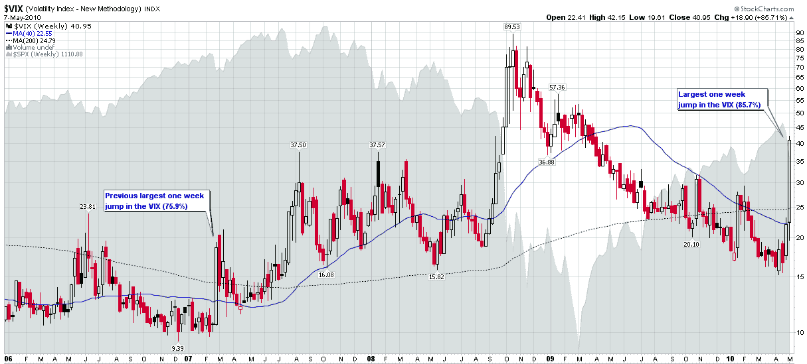

<!--yml

分类：未分类

日期：2024-05-18 17:10:38

-->

# VIX and More: Chart of the Week: The Weekly VIX

> 来源：[`vixandmore.blogspot.com/2010/05/chart-of-week-weekly-vix.html#0001-01-01`](http://vixandmore.blogspot.com/2010/05/chart-of-week-weekly-vix.html#0001-01-01)

在过去的一周里，金融市场发生了许多引人入胜的发展，因此很难挑选出一个图表作为这一周的[图表]。然而，由于这个博客的标题中有 VIX，因此似乎有失偏颇地忽略了一个事实：VIX 在上周的跳升超过了 VIX 自 1990 年初以来的整个历史，甚至包括追溯到 1990 年初的重构 VIX 数据。VIX 上周 85.7%的跳升轻松超过了之前记录的 75.9%，而那是在 2007 年 2 月 27 日的一周，当时上海证券交易所综合指数在一天之内下跌了 8.8%。

下面的图表捕捉了 VIX 自 2006 年初以来的周 K 线。图表突出了这样一个事实：大多数 VIX 的急剧波动都是一个 2-3 周的现象。在我看来，2008 年 9 月至 11 月创下的 VIX 纪录波动是那种每两三代人才会遇到的延长 VIX 波动的类型。

当前危机难以否定的困难在于，波动性有倾向于聚集，金融危机也是如此。例如，1997 年的[亚洲金融危机](http://vixandmore.blogspot.com/search/label/Asian%20financial%20crisis)帮助播下了 1998 年[俄罗斯金融危机](http://vixandmore.blogspot.com/search/label/Russian%20financial%20crisis)和[长期资本管理公司](http://vixandmore.blogspot.com/search/label/Long%20Term%20Capital%20Management)危机的种子。几年后，2000-2002 年科技股的熊市——以及政府的应对措施——帮助播下了 2007 年[次级抵押贷款](http://vixandmore.blogspot.com/search/label/subprime%20mortgage)危机开始，最终在 2008 年金融危机中盛开的房地产泡沫的种子。当前的欧洲主权债务危机肯定有很多根源在 2007 年和 2008 年的危机中。

所以尽管我不期望 VIX 在未来几天或几周内会保持在 40 以上，但我明白当前的危机将在经济和心理景观上留下深刻的疤痕，这些疤痕需要数月甚至数年才能完全愈合。更重要的是，政府对当前欧洲主权债务危机的应对可能会轻易延长当前波动的周期，或者通过放大未来金融危机效应的历史波纹。

当提到 VIX 和波动性时，看着历史正在形成通常是非常令人心痛和昂贵的，能够享受新记录的娱乐价值的观众寥寥无几。

关于相关主题的更多信息，建议读者查阅：

**来源：[StockCharts.com]**

**披露事项：** *撰写本文时 VIX 短期走势图表*
