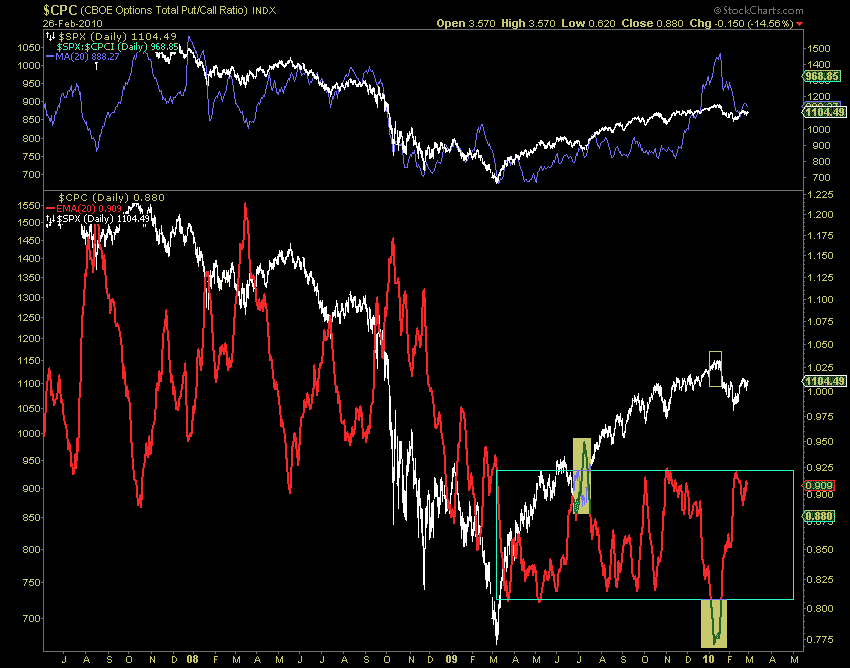

<!--yml

类别：未分类

日期：2024-05-18 17:14:34

-->

# VIX and More：每周图表：总看涨看跌比率

> 来源：[`vixandmore.blogspot.com/2010/03/chart-of-week-total-put-to-call-ratio.html#0001-01-01`](http://vixandmore.blogspot.com/2010/03/chart-of-week-total-put-to-call-ratio.html#0001-01-01)

感谢所有为[每周图表](http://vixandmore.blogspot.com/search/label/chart%20of%20the%20week)比赛提交图表的人。开始时进展缓慢，我对打开每周图表给读者的想法是否能够如我所愿而持怀疑态度，但当我收到两打以上的投稿时，我对它们所代表的工作范围和深度感到惭愧。

可惜只能有一个金牌得主，这一次（我相信我会再次这样做），获奖者是来自拉斯维加斯的 Amir。

Amir 的图表显示了如何使用芝加哥期权交易所的总看涨看跌比率（[CPC](http://vixandmore.blogspot.com/search/label/CPC)）可以帮助识别标普 500 指数在过去一年中的高点和低点。黄色突出显示的区域表明，总看涨看跌比率（总结了个股和指数的看涨和看跌活动）在 2009 年 6 月至 7 月的低点期间急剧上升，而就在上个月，跌至数年低点。显然，上个月的信号是一个在短期内至少进行空头交易的绝佳时机。极端读数是否会预示更陡峭的下跌，还有待观察。

我个人倾向于使用[ISEE](http://vixandmore.blogspot.com/search/label/ISEE)和[CPCE](http://vixandmore.blogspot.com/search/label/CPCE)（仅限股票）[看涨看跌比率](http://vixandmore.blogspot.com/search/label/put%20to%20call)数据，但这些指标中的任何一个都能产生出色的短期到长期市场定时信号。

为了他的努力，Amir 还赢得了一年免费订阅[*Expiring Monthly: The Option Traders Journal*](http://www.expiringmonthly.com/)。

再次感谢所有提交非常强大的图表的人。虽然这很有趣，但我会定期开放每周图表比赛给读者参与。  

更多相关主题，请鼓励读者查看：

*[来源：StockCharts]* ***披露：*** *我是 Expiring Monthly 的创始人和所有者之一*
