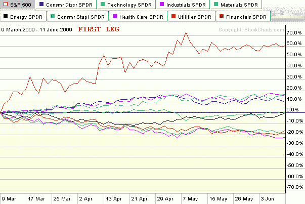
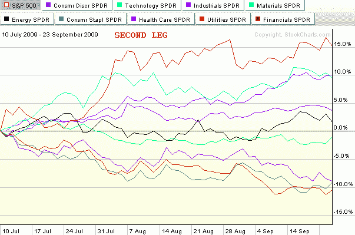
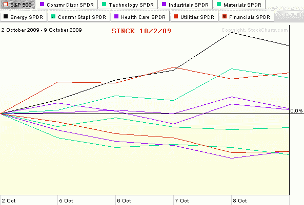

<!--yml

分类：未分类

日期：2024-05-18 17:26:57

-->

# VIX and More: Chart of the Week: Two Bull Legs and Counting…

> 来源：[`vixandmore.blogspot.com/2009/10/chart-of-week-two-bull-legs-and.html#0001-01-01`](http://vixandmore.blogspot.com/2009/10/chart-of-week-two-bull-legs-and.html#0001-01-01)

自股票触底并反弹约 61%（在 SPX 中）至当前水平以来的七个月里，已经出现了两个明显的牛市阶段。第一个阶段从 3 月 9 日（或 3 月 6 日的盘中低点）的低收盘开始，持续了不到三个月直到 6 月 11 日的高收盘。经过一个月的下跌后，第二个牛市阶段在 7 月 10 日启动，并持续了近两个半月，直到 9 月 23 日。这次回调似乎更为短暂，并且暂时结束于 10 月 2 日。

下面三张图表——共同构成了本周的[图表](http://vixandmore.blogspot.com/search/label/chart%20of%20the%20week)——捕捉了相对于 SPX 的板块表现（数字不是绝对值）的前两个牛市阶段，同时也加入了可能成为第三阶段的第一个星期。

注意，在前两个牛市的阶段中，金融股（[XLF](http://vixandmore.blogspot.com/search/label/XLF)）轻松成为了表现最好的板块。此外，在这两次情况下，材料股（[XLB](http://vixandmore.blogspot.com/search/label/XLB)）和工业股（[XLI](http://vixandmore.blogspot.com/search/label/XLI)）板块与其他板块明显分离，几乎并列第二和第三。这三个板块明确代表了在 2009 年最显著的牛市行情中的顶级表现。一个次级板块，包括消费品 discretionary（[XLY](http://vixandmore.blogspot.com/search/label/XLY)）、科技（[XLK](http://vixandmore.blogspot.com/search/label/XLK)）和能源股（[XLE](http://vixandmore.blogspot.com/search/label/XLE)），表现通常略高于基准的 SPX。底层包括三个防御性板块，它们通常只在市场低迷时超越 SPX。事实上，这三个板块——医疗保健（[XLV](http://vixandmore.blogspot.com/search/label/XLV)）、消费品必需品（[XLP](http://vixandmore.blogspot.com/search/label/XLP)）和公共事业（[XLU](http://vixandmore.blogspot.com/search/label/XLU)），在 6 月 11 日至 7 月 10 日的回调期间是表现最好的三个板块。

纯粹为了好玩，我在下面的图表中添加了上周的业绩。仅仅一周的上涨还太早得出结论，但到目前为止，10 月份的领先行业是能源。如果市场要继续创出 2009 年的新高，一个很大的问题将是之前的领先行业是否继续领跑，或者是否会有新的领导力量出现。就我个人而言，我不认为过去两个牛市的阶段所表现出的相同的业绩层次会在接下来的几个月的上涨中继续。事实上，我预计领导力量将转移到第二层次，以科技、能源或消费品股票的形式。无论发生什么，如果金融行业开始落后于其他行业，将很有趣地看到 broader market 的表现如何。

图片来源于：[StockCharts]
