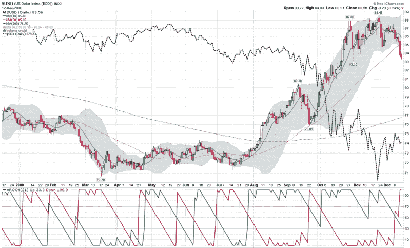

<!--yml

category: 未分类

date: 2024-05-18 18:11:11

-->

# VIX and More: Chart of the Week: U.S. Dollar Reverses Down

> 来源：[`vixandmore.blogspot.com/2008/12/chart-of-week-us-dollar-reverses-down.html#0001-01-01`](http://vixandmore.blogspot.com/2008/12/chart-of-week-us-dollar-reverses-down.html#0001-01-01)

There were many strong candidates for the [chart of the week](http://vixandmore.blogspot.com/search/label/chart%20of%20the%20week), but this week’s honor goes to the U.S. [Dollar](http://vixandmore.blogspot.com/search/label/dollar), which saw its largest one week drop in percentage terms in at least 25 years.

如下面的图表所示，过去五个月左右，美元与股票的走势呈现负相关。历史上，美元的下跌通常对股市并不利。然而，这将为出口商提供一些支持，并增强全球范围内以美元计价的大宗商品的需求。

美元的强势通常反映了交易者对美国经济相对于其他主要货币经济的强度的看法。因此，当美元上升时，这并不是对美国经济的信心投票，而更多的是反映了对其他国家可能面临更困难情况的担忧。现在，随着美国债务的激增和已经严重的经济危机，美国经济相对于一些其他全球经济的前景正在从最强变为可能只是略好于平均水平。

从 7 月到 11 月，美元汇率上涨了大约 23%。本周，美元再次自 7 月以来的涨势以来首次跌破了 50 日均线。像[Aroon](http://www.investopedia.com/articles/trading/06/Aroon.asp)这样的趋势指标开始显示出趋势反转的迹象；随着新趋势变得更加明显，预计趋势跟随系统将会做空美元。

不要惊讶于在未来几个月内看到 23%的涨幅消失一半。

*[source: StockCharts, VIX and More]*
