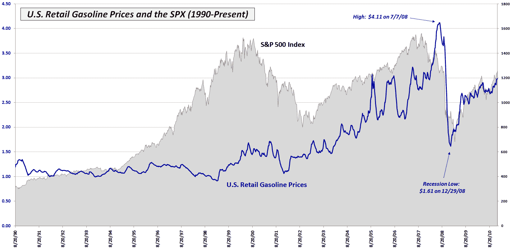

<!--yml

类别：未分类

日期：2024-05-18 16:55:34

-->

# 维克斯和更多：本周图表：美国零售汽油价格

> 来源：[`vixandmore.blogspot.com/2010/12/chart-of-week-us-retail-gasoline-prices.html#0001-01-01`](http://vixandmore.blogspot.com/2010/12/chart-of-week-us-retail-gasoline-prices.html#0001-01-01)

随着越来越多的数据点开始暗示过去几个月的绿色复苏苗头终于开始发展，对能源领域供需的担忧再次开始升温。

在过去的一周里，美国平均零售汽油价格飙升到了每加仑 2.98 美元（在我居住的旧金山，价格达到了每加仑 3.29 美元，但谁在计算呢？）达到了危机后的最高点。

本周的[图表](http://vixandmore.blogspot.com/search/label/chart%20of%20the%20week)显示了美国零售汽油价格 21 年来的变化（蓝线）以及标普 500 指数（灰色区域图表）的背景。注意，汽油价格在 2008 年 7 月达到峰值，每加仑 4.11 美元，并在六个月后的年底跌至每加仑 1.61 美元。

毫不奇怪，汽油价格在股市之后达到峰值，并在金融恐慌期间跟随股市下跌。有趣的是，汽油实际上在股市底部之前约 2 ½个月触底，并且在过去两年中，两者都沿着非常相似的轨迹回升至之前的高点。

向前看，汽油价格的持续上涨应该开始对消费者支出施加压力，并减缓经济增长和股市的反弹。这一现象是否会在每加仑 3.00 美元的另一边开始显现，或者在更高的水平上出现，还有待观察，但这消费者修复资产负债表、增加支出并推动 70%依赖于消费者支出以实现经济增长的 GDP 的重要因素。

相关文章：

数据来源：能源信息管理局

***披露：*** *无*
