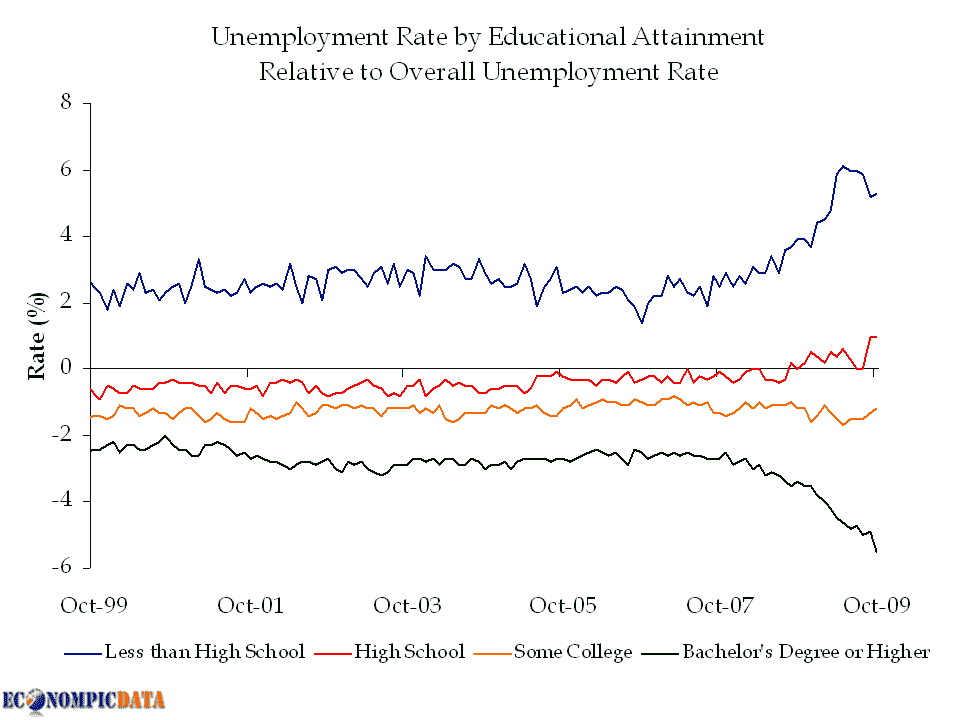

<!--yml

分类：未分类

date: 2024-05-18 17:23:05

-->

# VIX 和更多：本周图表：失业率与教育水平

> 来源：[`vixandmore.blogspot.com/2009/11/chart-of-week-unemployment-rates-and.html#0001-01-01`](http://vixandmore.blogspot.com/2009/11/chart-of-week-unemployment-rates-and.html#0001-01-01)

虽然我偏爱使用自制的图表作为我的[本周图表](http://vixandmore.blogspot.com/search/label/chart%20of%20the%20week)，但本周 particularly 吸引我注意的是一张来自[EconomPic Data](http://econompicdata.blogspot.com/)的图表，它比较了近期失业率的相对水平与总体[失业率](http://vixandmore.blogspot.com/search/label/unemployment%20rate)的变化。

读者可能需要一点时间来熟悉这个图表，但本质上它显示了教育水平在失业可能性中日益成为一个因素。大约十年前，高中以下学历者的失业率（深蓝色线）比人口平均失业率高约 2%，而拥有学士学位或更高学历者的失业率比所有工人的平均失业率低约 2%。到了 2009 年，这一差距扩大到三倍，这意味着高中以下学历者的失业率比平均失业率高 6%，同时，拥有学士学位或更高学历者现在的失业率比所有工人的平均失业率低约 6%。

不出所料，数据显示教育水平与收入水平和失业率高度相关。虽然这些事实对任何人来说都不应该感到惊讶，但它们确实解释了一些最近的收入不平等数据，并可能对未来产生有趣的政治、社会和其他影响。

*[source: EconomPic Data, Bureau of Labor Statistics]*
