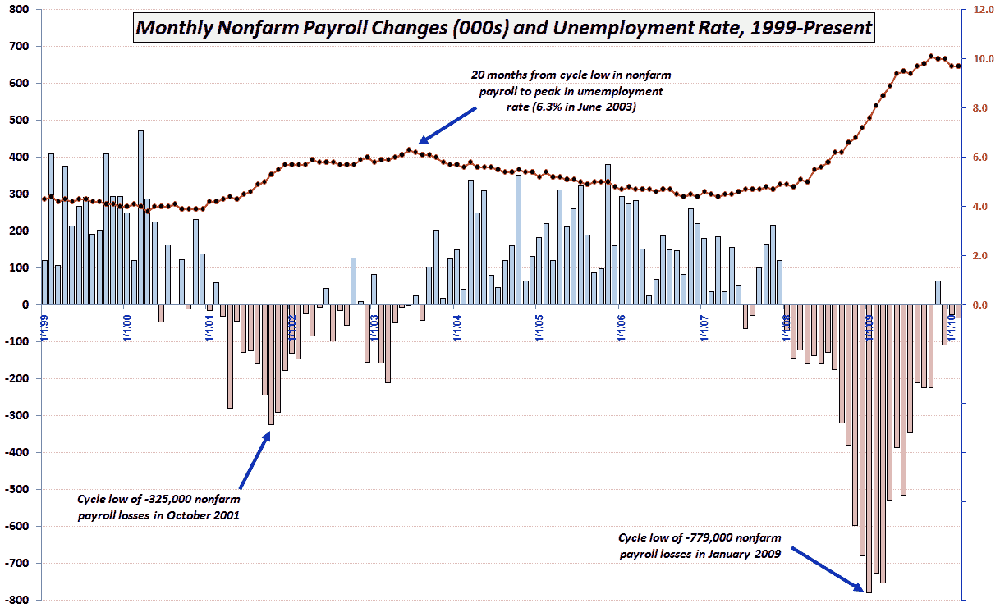

<!--yml

分类：未分类

日期：2024-05-18 17:14:11

-->

# VIX and More: Chart of the Week: Updated Nonfarm Payrolls and Unemployment Rate

> 来源：[`vixandmore.blogspot.com/2010/03/chart-of-week-updated-nonfarm-payrolls.html#0001-01-01`](http://vixandmore.blogspot.com/2010/03/chart-of-week-updated-nonfarm-payrolls.html#0001-01-01)

每当发布就业报告的那一周，那些数据都会自动成为[本周图表](http://vixandmore.blogspot.com/search/label/chart%20of%20the%20week)的候选。考虑到劳工统计局[修正](http://www.bls.gov/ces/cescensusnote.htm)了一些历史数据系列，并且股市因不如预期的工资损失而急剧上涨，这似乎是一个更新一直很受欢迎的图表的好时机，而这个图表我已经七个月没有发布了。

下面的图表展示了自 1999 年以来[非农就业人数](http://vixandmore.blogspot.com/search/label/nonfarm%20payrolls)和[失业率](http://vixandmore.blogspot.com/search/label/unemployment%20rate)的月度变化，并捕捉到了这两个指标的近期平台期。注意，在 2002 年和 2003 年初，工资单数据显示在 2003 年最后一个季度持续的工资增长开始之前，偶尔会出现正值的突增。也值得注意，失业率在 2003 年达到峰值之前，一直等到从 2001 年 10 月开始的工资损失高峰之后的*20 个月*。

当然，每一次复苏都是不同的，但从劳动力的角度来看，仍然可以认为就业情况的底部迹象还不够充分。

关于相关主题的更多信息，读者们被鼓励去查看：

*[来源：劳工统计局]*

***披露：*** *无*
