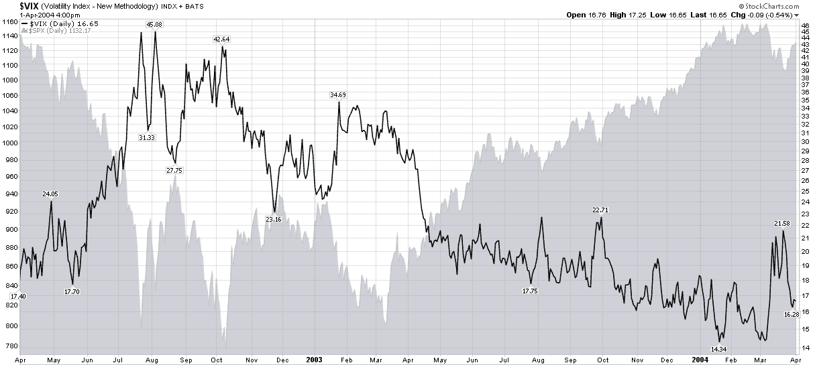

<!--yml

分类：未分类

日期：2024-05-18 17:13:28

-->

# VIX and More: Chart of the Week: VIX After 2002 Bottom

> 来源：[`vixandmore.blogspot.com/2010/03/chart-of-week-vix-after-2002-bottom.html#0001-01-01`](http://vixandmore.blogspot.com/2010/03/chart-of-week-vix-after-2002-bottom.html#0001-01-01)

关于持续下降的波动性所听到的所有评论，人们可能会认为 VIX 跌至 17.00 以下是不合理的异常。但有几个因素建议并非如此。

支持 VIX 走低的最具说服力的统计证据之一是 SPX 的 20 天历史波动率，本周结束时为 9.10，周四收盘价为 8.68。虽然确实对于 VIX 的历史而言，其通常高于 SPX 的历史波动率，但平均溢价约为 35%，而不是周五的异常高 86%。

除了统计证据外，将当前的涨势放在历史背景下也是有帮助的。在下面的[本周图表](http://vixandmore.blogspot.com/search/label/chart%20of%20the%20week)中，查看[2002](http://vixandmore.blogspot.com/search/label/2002)年的低点，可以看到在 2002 年 10 月初 SPX 触底时，VIX 曾一度超过 42.00。大约 12 ½个月后，即 2003 年 10 月中旬，VIX 在 16 左右徘徊，到月底时降至约 16.00，并在大约 3 ½个月后的某个周期低点达到 14 左右。

由于现在股票距离 2009 年 3 月的低点也大约 12 ½个月，VIX 在 16 左右不应该让人感到意外，特别是考虑到历史波动率水平，现在普遍低于 2003 年 10 月。

尽管我认为 VIX 可能会走低，但我的个人预测是，在 4 月的期权到期周期内，VIX 很难在 16.00 以下获得动力。

关于相关主题，读者可以查阅以下内容：

*[来源：StockCharts]*

***披露(s):*** *无*
