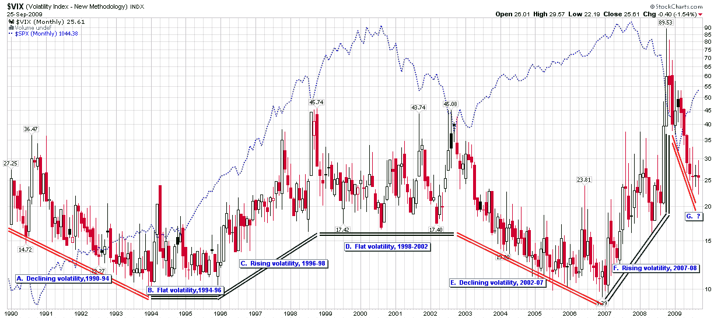

<!--yml

分类：未分类

日期：2024-05-18 17:28:24

-->

# VIX and More: 图表周：VIX 宏观周期和 VIX 的新地板

> 来源：[`vixandmore.blogspot.com/2009/09/vix-macro-cycles-and-new-floor-in-vix.html#0001-01-01`](http://vixandmore.blogspot.com/2009/09/vix-macro-cycles-and-new-floor-in-vix.html#0001-01-01)

上次我更新我的[VIX 宏观周期](http://vixandmore.blogspot.com/search/label/VIX%20macro%20cycles)图表时，超过五个月前，VIX 刚刚跌破 40.00，我正在寻找一个低至 25.00 左右的地板。有一段时间，24.00 附近的区域提供了重要的支撑，但随着周三 22.19 的低点，是时候正式更新我对 VIX 新地板的思考，并将当前的波动率下降环境放在过去 20 年 VIX 历史数据的角度。

本周的[图表](http://vixandmore.blogspot.com/search/label/chart%20of%20the%20week)显示了自 1990 年 VIX 数据历史重构以来，七个不同的 VIX 宏观周期，这些周期通常持续 2-4 年。图表突显了 2008 年下半年和 2009 年第一季度 VIX 波动率的极端异常和高波动性。我发现这个月度图表显示了连续三个月的十字星 K 线模式，实体几乎完全相同——这意味着尽管月份内波动范围很大，但最后三个月 VIX 的开盘价和收盘价非常相似。

注意，在之前一次波动率长时间高位的情况下，从 1998 年到 2003 年，在 20-22 的范围内找到了强支撑。

实际上，自 1990 年以来 VIX 的终身平均（均值）为 20.25，而 10 年平均为 22.11。

出于这些和其他原因，我认为至少到年底，21.50-22.00 的水平将作为一个 VIX 地板保持稳定。

同样，最新的 VIX 宏观周期，始于 2008 年 12 月，是一个波动率下降的时期，可能已经结束，并且肯定会在年底前结束。

对于关于 VIX 宏观周期的更多帖子，读者们被鼓励去查看：

**

*[来源：StockCharts]*
