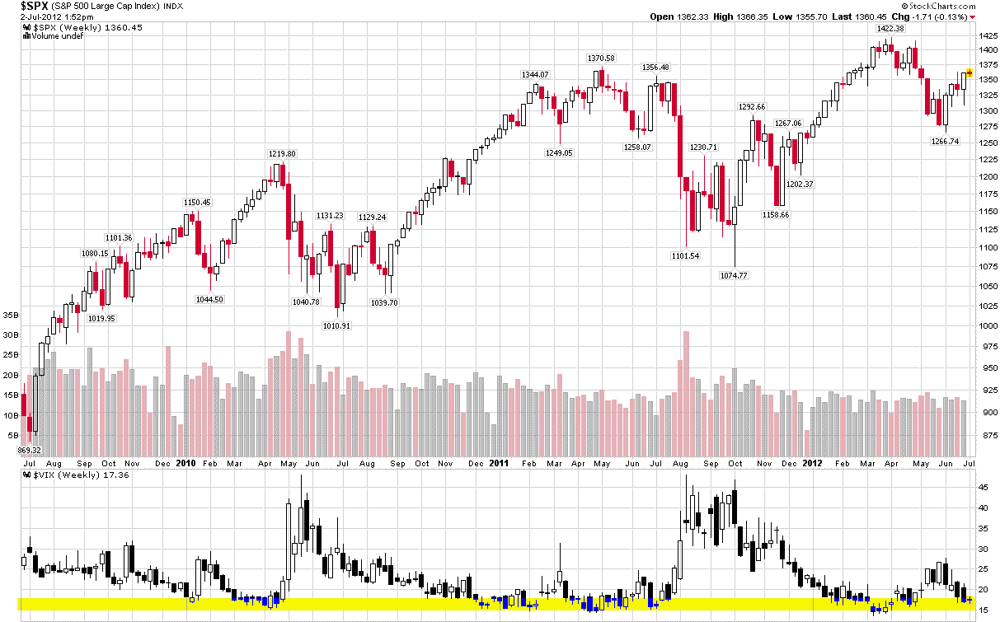

<!--yml

分类：未分类

日期：2024-05-18 16:27:07

-->

# VIX and More: Chart of the Week: VIX Reversal Signal Coming Soon?

> 来源：[`vixandmore.blogspot.com/2012/07/chart-of-week-vix-reversal-signal.html#0001-01-01`](http://vixandmore.blogspot.com/2012/07/chart-of-week-vix-reversal-signal.html#0001-01-01)

有时分析 VIX 的最简单方法才是最好的。

下面的[周线图](http://vixandmore.blogspot.com/search/label/chart%20of%20the%20week)展示了标普 500 指数和 VIX 过去三年的周 K 线。在 VIX 研究的底部，我还用黄色突出显示了 15-18 的区间，这一区间在这段时间内已被证明是 VIX 的一个相对强劲的支撑区域。注意，虽然 VIX 偶尔会跌破 15，但它最终每次都会从这一支撑水平反弹，而且更值得注意的是，每次 VIX 在 15-18 区间的底部都与 SPX 顶部相吻合。

随着 VIX 目前跌至 17 以下，无论多头还是空头都应警惕 VIX 底部形成的迹象——并准备好相应调整投资组合。

相关文章：

**

*[数据来源：StockCharts.com]*

***声明：*** *无*
