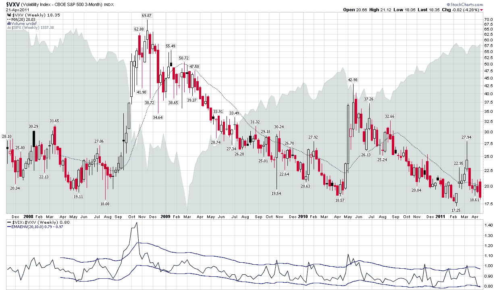

<!--yml

分类：未分类

日期：2024-05-18 16:51:06

-->

# VIX 和更多：本周图表：VXV 处于关键时刻

> 来源：[`vixandmore.blogspot.com/2011/04/chart-of-week-vxv-at-critical-juncture.html#0001-01-01`](http://vixandmore.blogspot.com/2011/04/chart-of-week-vxv-at-critical-juncture.html#0001-01-01)

考虑将银价或 VIX 之外的东西作为本周股票似乎几乎是一种异端，但既然关于这两个主题已经有了如此多的文章和图表，我认为我可能提供一点不同的视角。

是的，是时候再次吹嘘[VXV](http://vixandmore.blogspot.com/search/label/VXV)的重要性了。对于那些可能已经忘记的人来说，VXV 的正式名称是 CBOE S&P 500 3 个月波动指数。CBOE 在这里[详细描述了该指数](http://www.cboe.com/micro/vxv/3monthvix.pdf)，但关键要点是 VXV 基本上是 30 天 VIX 的 93 天版本。换句话说，VIX 只看一个月潜在波动和金融市场干扰，而 VXV 的时间范围是一个季度。这意味着，除了其他事情之外，尽管关于希腊债务重组可能没有重大发展，但这个问题在接下来三个月内不太可能不会得到解决。

出于这些和其他原因，我一直认为 VXV 比 VIX 更好地反映长期和[结构/系统波动](http://vixandmore.blogspot.com/search/label/structural%20volatility)，而 VIX 更适合测量短期[事件波动](http://vixandmore.blogspot.com/search/label/event%20volatility)。

从 VXV 于 2007 年 10 月推出以来的周线图来看，人们无法不注意到 17.50 - 18.00 区域的历史支撑模式。周五收盘时 VXV 下跌至 18.35。若几个收盘价低于此水平，可能不仅预示着结构波动和长期风险的变化，还预示着新的波动率时代的到来。

相关文章：

***披露(s):** 撰写本文时通过期权持有 VIX 的中性立场*

**[图表：StockCharts.com]**
