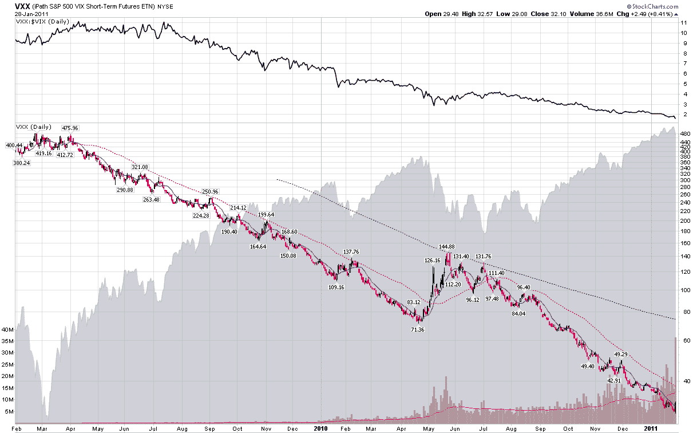

<!--yml

分类：未分类

日期：2024-05-18 16:53:37

-->

# VIX and More: Chart of the Week: VXX Celebrates 2nd Birthday

> 来源：[`vixandmore.blogspot.com/2011/01/chart-of-week-vxx-celebrates-2nd.html#0001-01-01`](http://vixandmore.blogspot.com/2011/01/chart-of-week-vxx-celebrates-2nd.html#0001-01-01)

一年前的今天，在[Chart of the Week: VXX Celebrates One Year of Futility](http://vixandmore.blogspot.com/2010/01/chart-of-week-vxx-celebrates-one-year.html)一文中，我记录了 iPath S&P 500 VIX Short-Term Futures ETN（大多数情况下以其股票代码 VXX 为人所知）的第一年。当时，我注意到 VXX 在其第一个年度下跌了 68.4%，并做出了预测，“我预计 VXX 在其第二年的表现会相对于 VIX 表现得更好，尽管承认这并不是一个很高的门槛。”

好吧，无论低门槛与否，VXX 在其第二年的表现甚至比第一年还要糟糕。尽管 VXX 在第二个交易日上涨了 8.4%，以高昂的气氛结束了第二年，但其第二年的表现下滑至-74.6%，使得这个 ETN 自两年前成立以来下跌了 92%。

虽然我在过去两年里一直在记录 VXX 的不足之处，但让我明确地说，VXX 确实做到了它旨在做的事情：捕获一个持续期限为 30 天的[VIX 期货](http://vixandmore.blogspot.com/search/label/VIX%20futures)组合，通过每日滚动来实现这一持续期限。正如下面链接和本博客其他许多地方所详细说明的，正是面对持续的[正向市场](http://vixandmore.blogspot.com/search/label/contango)时产生的每日滚动触发了负的[滚动收益率](http://vixandmore.blogspot.com/search/label/roll%20yield)，对 VXX 的价格产生了拖累。实际上，自从去年 8 月底以来，VIX 期货的正向市场一直非常高，这很大程度上解释了为什么在 VIX 仅下跌 18.6%的情况下，VXX 在过去一年里下跌了 74.6%。要比较 VXX 第二年与第一年的正向市场影响，只需知道第一年 VIX 的表现优于 VXX 26.2%，而在刚刚结束的一年里，VIX 的表现优于 VXX 高达 56.0%。

这并不意味着投资者应该回避 VIX 作为波动性交易。从短期来看，VXX 是一个可行的做多波动性的交易，正如周五的 8.4%的涨幅所证明的那样。当 VIX 期货曲线从正向市场转为[反向市场](http://vixandmore.blogspot.com/search/label/backwardation)时，VXX 也可能成为一个有吸引力的交易。当投资者持有的期限超过几天时，做多方面的问题就开始了。从长远来看，波动性是[均值回归](http://vixandmore.blogspot.com/search/label/mean%20reversion)的，并且不提供任何自然的方向性优势。因此，持有期限越长，VXX 交易就越成为[期限结构](http://vixandmore.blogspot.com/search/label/term%20structure)而非方向性交易，而期限结构在正向市场和反向市场之间大约有 75%的时间更倾向于正向市场。

有了这个想法，我将重复我一年前做出的同样的预测，毫不畏惧：VXX 在未来一年的表现将优于过去一年相对于 VIX 的表现。

相关文章：

*[来源：StockCharts.com]*

********披露(s)：*** *在撰写本文时做空 VXX 和 VIX*
