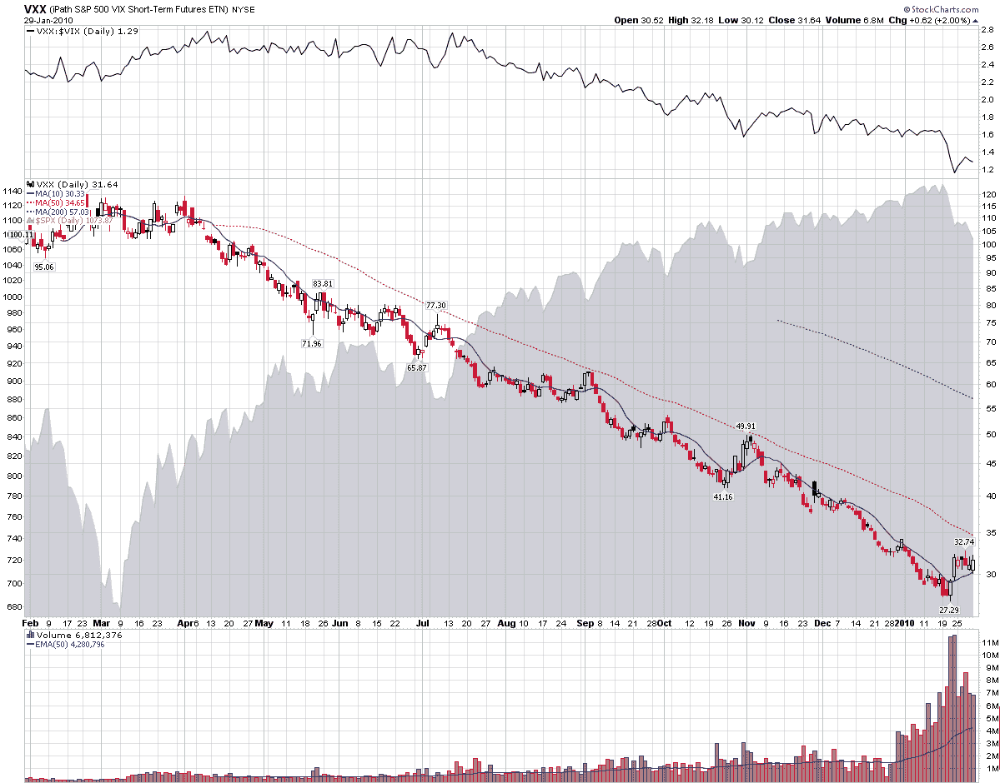

<!--yml

分类：未分类

日期：2024-05-18 17:16:39

-->

# VIX and More: Chart of the Week: VXX Celebrates One Year of Futility

> 来源：[`vixandmore.blogspot.com/2010/01/chart-of-week-vxx-celebrates-one-year.html#0001-01-01`](http://vixandmore.blogspot.com/2010/01/chart-of-week-vxx-celebrates-one-year.html#0001-01-01)

一年前的昨天，iPath S&P 500 VIX Short-Term Futures (1 month) ETN ([VXX](http://vixandmore.blogspot.com/search/label/VXX))低调推出，除了在 ETN 上市时 VXX 和兄弟产品[VXZ](http://vixandmore.blogspot.com/search/label/VXX)获得[广泛报道](http://vixandmore.blogspot.com/2009/01/first-day-of-trading-in-vxx-and-vxz.html)之外。

VXX 那天开盘价为 100.11，VIX 为 42.63。一年后，VXX 下跌了 68.4%，VIX 下跌了 42.2%。

撇开杠杆 ETF 不谈，过去一年中持有 VXX 无疑是亏钱的最佳方式。将 VXX 的 68.4%跌幅放在心上，还有另外两只 ETF 投资者可能损失了 50%的投资：做空金融([SEF](http://vixandmore.blogspot.com/search/label/SEF))，下跌了 52%；和做空新兴市场([EUM](http://vixandmore.blogspot.com/search/label/EUM))，下跌了 50%。做多天然气([UNG](http://vixandmore.blogspot.com/search/label/UNG))和做空基础金属([BOS](http://vixandmore.blogspot.com/search/label/BOS))都会导致 48%的损失。

这周的[图表](http://vixandmore.blogspot.com/search/label/chart%20of%20the%20week)展示了 VXX 的全部无用之处，顶部显示了 VXX 与 VIX 的比率，以观察 VXX 在过去一年中表现如何逊色于现金/现货波动率指数。

下面的链接解释了负面[滚动收益率](http://vixandmore.blogspot.com/search/label/roll%20yield)和其他因素如何导致 VXX 表现逊于 VIX，并取得如此灾难性的表现。综合考虑，我认为 VXX 在其第二年相对于 VIX 的表现会比第一年有所改善，尽管承认这并不是一个很高的门槛。

关于 VXX 的构建和表现更多信息，读者可以查阅：

**来源：[StockCharts]**

***披露：*** 在撰写本文时持有**少量 VXX**。
