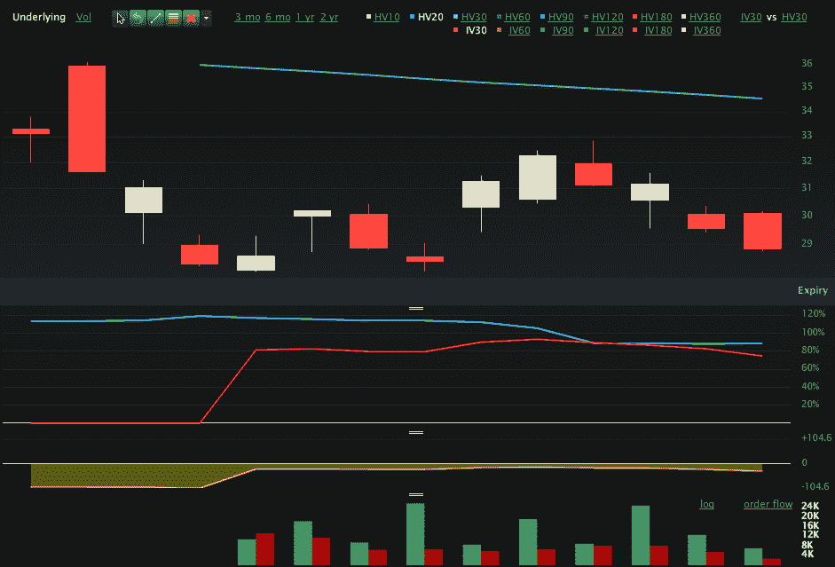

<!--yml

分类：未分类

日期：2024-05-18 17:08:15

-->

# VIX 和更多：本周图表：VXX 期权

> 来源：[`vixandmore.blogspot.com/2010/06/chart-of-week-vxx-options.html#0001-01-01`](http://vixandmore.blogspot.com/2010/06/chart-of-week-vxx-options.html#0001-01-01)

仅仅两周前推出的[VXX 期权](http://vixandmore.blogspot.com/search/label/VXX%20options)已经吸引了大量的关注，平均每天约有 17,000 份合约交易。虽然对于这么短的时间来说这个数字很令人印象深刻，但与每天通常交易的 260,000 份左右的 VIX 期权相比，这个数字仍然相形见绌。

如本周图表所示（该图表使用了从 5 月 23 日到现在的[VXX](http://vixandmore.blogspot.com/search/label/VXX)数据），VXX 看涨期权成交量大约是 VXX 看跌期权成交量的两倍。现在判断 VXX 期权数据是否可能标识出聪明钱或愚蠢钱还为时尚早，但值得注意的是，VXX 看涨成交量最大的激增（底部的绿色条形图）之前 VXX 有一次不错的上涨。另一方面，VXX 看涨期权第二大成交量的一天是在上周三，即标普 500 指数上涨 3.0%并且导致波动率暴跌的前一天。

今后，我可能会让 VXX 期权成为本空间的一个热门话题，特别是因为 VXX 期权可以与基础资产，即 VXX ETN 相结合使用。

对于相关主题的更多信息，读者们被鼓励去查阅：

来源：[Livevol Pro]

***免责声明：*** *写作时持有 VXX 空头仓位*
