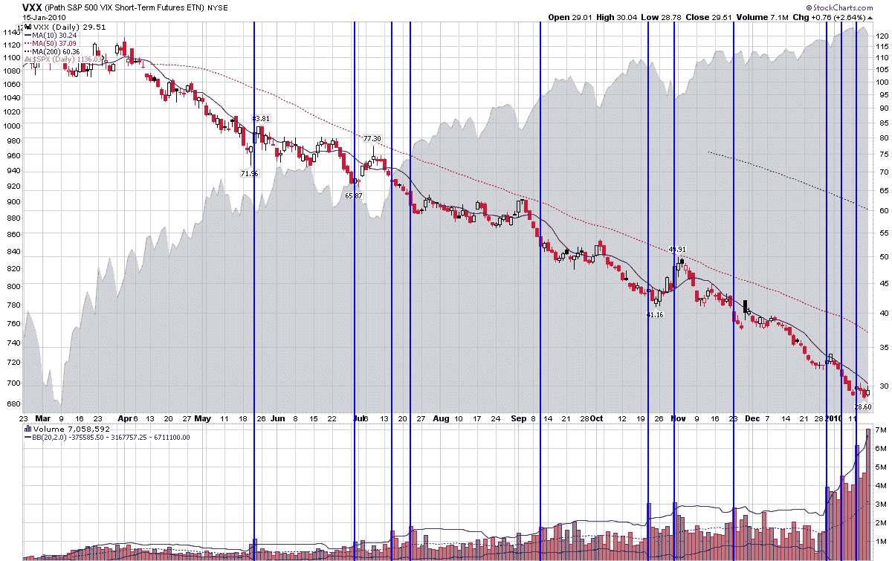

<!--yml

分类：未分类

日期：2024-05-18 17:17:44

-->

# VIX 和更多：本周图表：VXX 交易量激增

> 来源：[`vixandmore.blogspot.com/2010/01/chart-of-week-vxx-volume-surges.html#0001-01-01`](http://vixandmore.blogspot.com/2010/01/chart-of-week-vxx-volume-surges.html#0001-01-01)

我决定在新的一年开始时休假几周，后来惊讶地得知，就在我减少发帖后，iPath S&P 500 VIX Short-Term Futures ETN（[VXX](http://vixandmore.blogspot.com/search/label/VXX)）的人气激增，交易量——在 2009 年从未达到过 400 万股——在过去的 8 个交易中有 7 个交易超过了 400 万股。

虽然我相信 VXX 的交易量激增只是一个巧合，我能理解为什么人们可能认为 VIX 在 17.91（一周前是 16.86）似乎有点低，但重要的是要注意，VIX 的 1 月期货现在已低于 20.00，从历史波动性的角度来看，当前水平的 VIX 实际上有所上升。

然而，显然有很多投资者认为，鉴于宏观经济风险，当前的 VIX 水平似乎是合理的。这种直觉感觉可能是由于[可用性偏见和灾难印记](http://vixandmore.blogspot.com/2009/11/availability-bias-and-disaster.html)，但显然还有其他因素在起作用。

在这周的[图表](http://vixandmore.blogspot.com/search/label/chart%20of%20the%20week)中，我试图捕捉 VXX 的价格和交易量历史，用蓝色垂直条标出了之前的一些主要波动激增。底线是，尽管之前的 VXX 交易量激增在某些情况下确实在波动性上升之前捕捉到了低点，但这些通常只是 3-5 天的小幅波动。此外，虽然 VXX 在交易量激增后一周或更长时间内确实表现出色，但从一个月到一天，VXX 多头头寸总的来说*仍然亏钱*。因此，虽然 VXX 交易量激增时可能存在一小部分“聪明钱”效应，但通过 VXX 多头头寸，“聪明钱”实际上只是亏钱的速度更慢。

在我的[订阅者通讯](http://vixandmoresubscriber.blogspot.com/)中，我已经详细讨论了与 VXX 相关的问题，但读者可以在下面链接的博客文章中了解到我的担忧。

具体来说，关于 VXX 的更多信息，读者可以查阅：

*[来源：StockCharts]*

**披露**：无
