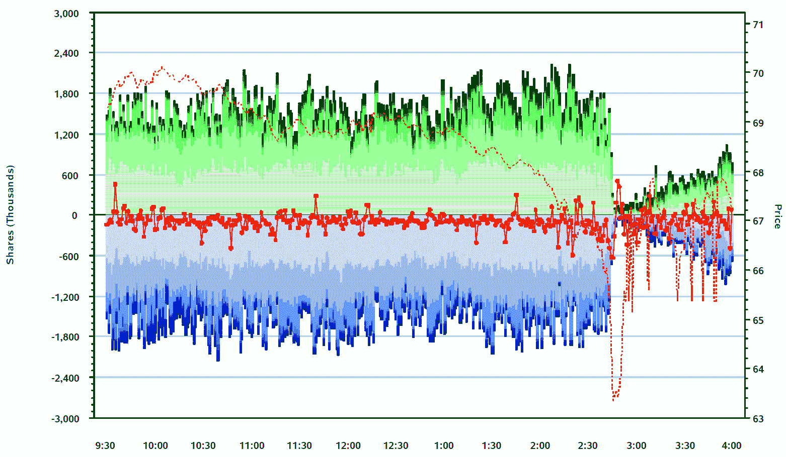

<!--yml

分类：未分类

date: 2024-05-18 17:02:07

-->

# VIX 和更多：本周图表：可视化闪电崩盘

> 来源：[`vixandmore.blogspot.com/2010/10/chart-of-week-visualizing-flash-crash.html#0001-01-01`](http://vixandmore.blogspot.com/2010/10/chart-of-week-visualizing-flash-crash.html#0001-01-01)

本周，美国证券交易委员会（SEC）和商品期货交易委员会（CFTC）发布了关于“[闪电崩盘](http://vixandmore.blogspot.com/search/label/flash%20crash)”的联合报告，标题为[2010 年 5 月 6 日市场事件调查结果](http://www.sec.gov/news/studies/2010/marketevents-report.pdf)。

尽管许多人对这份报告感到失望，但它让交易员对道琼斯工业平均指数波动 1138 点的当天发生的一些事情有了感觉。

下方的[本周图表](http://vixandmore.blogspot.com/search/label/chart%20of%20the%20week)显示了[IWM](http://vixandmore.blogspot.com/search/label/IWM)的情况，这是标普 2000 指数的高流动性 ETF。IWM 每天交易超过 6000 万股，是交易最活跃的股票之一。直到东部时间下午 2:43，IWM 的表现都是正常的。然后，当价格（虚线，右侧刻度）开始加速下跌时，流动性（左侧刻度的绿色和蓝色带状区域）突然开始枯竭。到了下午 2:46，IWM 的市场深度（绿色和蓝色带状区域的高度）几乎完全消失。在正常交易时段剩下的 74 分钟里，流动性开始慢慢回到市场。到市场收盘时，大约有 60%的正常市场深度从当天早些时候回到了 IWM。

上述链接中的报告包含了一些关于[ACN](http://vixandmore.blogspot.com/search/label/ACN)、[PG](http://vixandmore.blogspot.com/search/label/PG)、[MMM](http://vixandmore.blogspot.com/search/label/MMM)、[IBM](http://vixandmore.blogspot.com/search/label/IBM)、[AAPL](http://vixandmore.blogspot.com/search/label/AAPL)、[GE](http://vixandmore.blogspot.com/search/label/GE)和 IWM 的有趣图表，从 PDF 的第 91 页开始。总的来说，IWM 的行动是这些股票中最不极端的。

如果你有时间，这份报告至少值得一瞥。

相关文章：

*[source: SEC and CFTC]*

****披露信息：*** *无*
