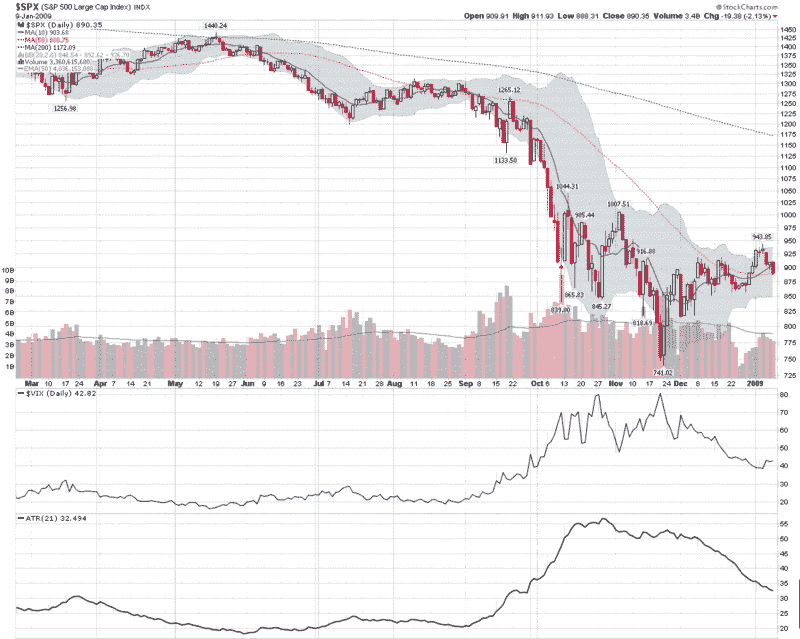

<!--yml

分类：未分类

日期：2024-05-18 18:06:48

-->

# VIX 和更多：本周图表：波动性逐渐下降

> 来源：[`vixandmore.blogspot.com/2009/01/chart-of-week-volatility-drifts-lower.html#0001-01-01`](http://vixandmore.blogspot.com/2009/01/chart-of-week-volatility-drifts-lower.html#0001-01-01)

尽管本周股票回吐了一些涨幅，任何关于牛市必然性的感觉都被从 bulls 的意识中抹去，波动性在图表上只是不情不愿地开始重新出现。

实际上，如果你查看下方的[本周图表](http://vixandmore.blogspot.com/search/label/chart%20of%20the%20week)，你会看到更多关于未来波动性的担忧，体现在 VIX 上，而不是当前波动性上升的迹象，这反映在标普 500 指数的[平均真实范围](http://vixandmore.blogspot.com/search/label/average%20true%20range)（ATR）上。我选择了 21 天设置的 ATR，因为它基于交易日，大致相当于 VIX 使用的 30 个日历时间跨度。记录在案，将 ATR 窗口缩短至 10 天显示出相同的波动性下降模式。标普 500 指数[历史波动率](http://vixandmore.blogspot.com/search/label/historical%20volatility)的图表同样平静，目前 20 天历史波动率在 31 左右徘徊。

即使在本周市场下跌的情况下，波动性仍然相对较低，至少按雷曼兄弟破产后的标准来衡量。

*[来源：StockCharts]*
