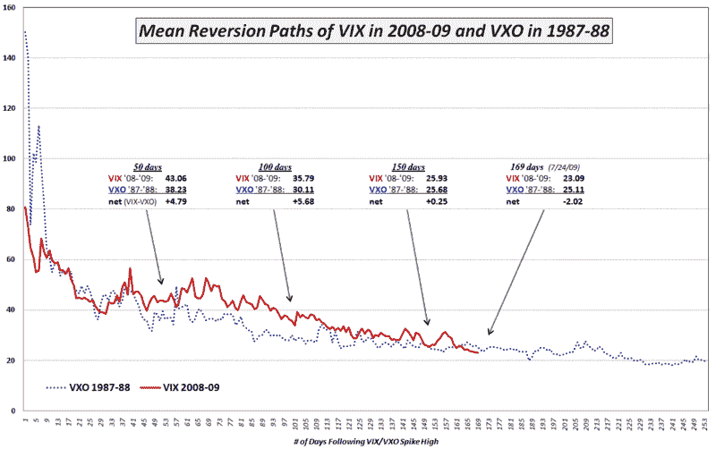

<!--yml

类别：未分类

日期：2024-05-18 17:36:50

-->

# VIX 和更多：本周图表：1987-88 年和 2008-09 年的波动性和均值回归

> 来源：[`vixandmore.blogspot.com/2009/07/chart-of-week-volatility-and-mean.html#0001-01-01`](http://vixandmore.blogspot.com/2009/07/chart-of-week-volatility-and-mean.html#0001-01-01)

在这周的[本周图表](http://vixandmore.blogspot.com/search/label/chart%20of%20the%20week)中，我选择比较了 1987 年和 2008 年波动性激增后的情况。对于[1987](http://vixandmore.blogspot.com/search/label/1987)系列，从黑色星期一开始，我选择使用自 2003 年以来在[VXO](http://vixandmore.blogspot.com/search/label/VXO)标签下跟踪的“原始 VIX”的重构，并在大约 172 时达到顶峰；对于 2008 年，我从 11 月 20 日开始，收盘价为 80.86 是 VIX 收盘价最高记录。

关键结论是，在波动性激增后前六个月，1987-88 年的波动性下降速度比 2008-09 年快。这并不奇怪，因为共识是 1987-1988 年的结构波动性要小得多，极端风险时期也短得多，而 2008-09 年则相反。有趣的是，然而，自从 11 月 20 日的[VIX 激增](http://vixandmore.blogspot.com/search/label/VIX%20spikes)以来，已经过去了八个月零 169 个交易日，目前的环境波动性下降到了比 1987-88 年波动性激增后八个月更低的水准。

图形强调，2008-09 年的波动性保持在 1987-88 年以上的 50、100 和 150 天里程碑水平。然而，在最近的一个月里，2009 年的波动性水平一直低于 21 年前的读数。究竟 2009 年的风险是否真的比 1988 年低，或者当前时期是否仅仅是由更高的 complacency 水平所特征，还有待观察。

对于那些可能想要谈论将 VIX 与 VXO 进行比较的人，请注意，周五 VIX 收盘价为 23.09，VXO 收盘价为 23.06。使用 2008-2009 年的 VXO 数据将导致相同的结论，数据略有不同。

对于相关文章，请参阅：

*[来源：雅虎]*
