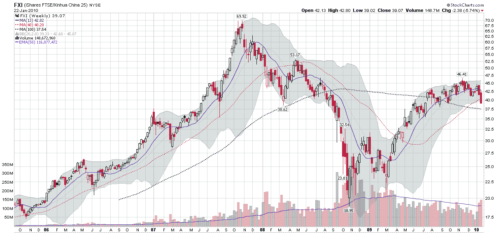

<!--yml

分类：未分类

日期：2024-05-18 17:17:34

-->

# VIX 和更多：本周图表：周 FXI

> 来源：[`vixandmore.blogspot.com/2010/01/chart-of-week-weekly-fxi.html#0001-01-01`](http://vixandmore.blogspot.com/2010/01/chart-of-week-weekly-fxi.html#0001-01-01)

那些一直在等待 VIX 显著飙升来预示投资者情绪转变的投资者们，上周终于有了可以深入研究的内容。另一方面，那些密切关注中国市场的投资者们，自去年 11 月中旬以来，看到了一个逐渐恶化的局面。

事实上，[FXI](http://vixandmore.blogspot.com/search/label/FXI)，[iShares FTSE/Xinhua China 25 Index](http://www.ishares.com/product_info/fund/overview/FXI.htm)，目前已从去年 11 月的高点下跌了 15.8%，在过去的两周里大量下跌，目前已跌破其 40 周（200 天）移动平均线。

正如本周的[图表](http://vixandmore.blogspot.com/search/label/chart%20of%20the%20week)所示，FXI 自去年 7 月以来一直处于大致横盘整理状态，在从 2007 年 10 月的高点 69.92 和随后的 2008 年 10 月的低点 18.95 回撤约 54%之后。

请注意，在 2005-2007 年的短期回调中，40 周移动平均线起到了支撑作用。上周 40 周支撑线的突破比 2005-2007 年间的任何经历都要严重。如果 FXI 本周不能收在 40 周移动平均线以上，我不惊讶于看到该水平从支撑转为阻力，进一步确认中国股市正处于熊市。

有关相关主题的更多信息，读者们可以查阅：

此外，对于一个专注于中国经济基本面的优秀博客，我强烈推荐迈克尔·彼得斯（Michael Pettis）的《中国金融市场》（China Financial Markets）。

*[source: StockCharts]*

**披露：** *无*
