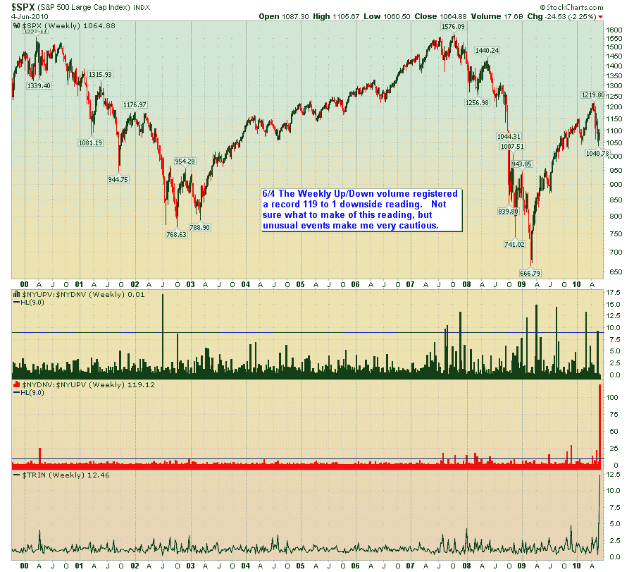

<!--yml

分类：未分类

日期：2024 年 05 月 18 日 17:08:37

-->

# VIX and More: Chart of the Week: Weekly Volume Flow

> 来源：[`vixandmore.blogspot.com/2010/06/chart-of-week-weekly-volume-flow.html#0001-01-01`](http://vixandmore.blogspot.com/2010/06/chart-of-week-weekly-volume-flow.html#0001-01-01)

感谢查理·汤普森提交本周的获奖[图表](http://vixandmore.blogspot.com/search/label/chart%20of%20the%20week)。再次有很多非常出色的条目。也许是因为我最近把我的大部分交易研究和开发集中在成交量领域，也许是因为我很少见到顶尖的成交量模式分析，我觉得查理的图表特别引人注目。此外，我倾向于在这个博客中将大部分重点放在短期和中期数据和分析上 - 鉴于过去一个月左右的事件，我认为现在是一个非常好的时机，可以用广角镜头来看待投资景观。

记录上，$NYUPV 是 NYSE 上所有上涨股票的总交易量，而$NYDNV 是 NYSE 上所有下跌股票的总交易量。因此，绿色条表示$NYDNV 与$NYUPV 的比率。[TRIN](http://vixandmore.blogspot.com/search/label/TRIN)也被称为阿姆斯指数。我在[牛市 TRIN 在年底](http://vixandmore.blogspot.com/2007/12/bullish-trin-as-year-winds-down.html)中讨论了指数的计算方法。

为了他的努力，查理还赢得了一年免费订阅[*Expiring Monthly：期权交易日志*](http://www.expiringmonthly.com/)。

就像上次一样，我也会在接下来的几天里突出一些我其他喜欢的条目。对于可能感兴趣的人，三月份的获奖者和三个荣誉提名的图表可以在下面的链接中找到。

欲了解更多相关主题，请读者参阅：

*[来源：StockCharts.com 和查理·汤普森]*

***披露：*** *我是 Expiring Monthly 的创始人和所有者之一*
