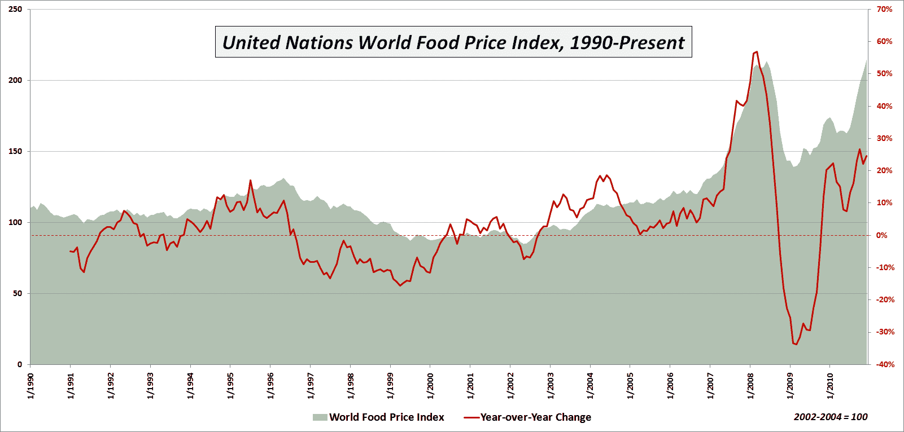

<!--yml

分类：未分类

日期：2024-05-18 16:54:37

-->

# VIX 和更多：本周图表：世界食品价格

> 来源：[`vixandmore.blogspot.com/2011/01/chart-of-week-world-food-prices.html#0001-01-01`](http://vixandmore.blogspot.com/2011/01/chart-of-week-world-food-prices.html#0001-01-01)

谈论日益上涨的[商品](http://vixandmore.blogspot.com/search/label/commodities)价格，似乎主要集中在能源和金属上，而农业商品常常被忽视，至少在美国是这样。

这周的[图表](http://vixandmore.blogspot.com/search/label/chart%20of%20the%20week)旨在强调农业商品以及“软商品”（通常指糖、咖啡和可可）在世界联合国粮食价格指数中的通货膨胀趋势。如下图所示，世界食品价格在 2009 年 2 月低点上涨超过 54%后，于 12 月创下新高。该指数的新高超过了 2008 年 6 月的高点。

在各种子指数中，糖的涨幅最为显著，仅四个月就上涨了 51%，在过去两年多的时间里飙升了 239%，创下了新的历史高点。肉类价格也创下了新高，但与目前糖价指数的 398.4 相比，肉类仅为 142.2\。请注意，所有指数值都反映了基于 2002-2004 年平均价格的 100 个基点。

商品价格对经济和政治都有影响。对新兴市场的影响尤其严重，在这些市场中，食品成本占典型家庭预算的比例过高。在这里，食品价格的微小增加可能对家庭成本结构产生灾难性的影响。还有一些国家，食品暴乱和相关社会动荡有可能破坏当权者，在某些情况下甚至可能将政治体制推向混乱。

到目前为止，不断上涨的食品价格只是在各地引发了轻微的反对，但如果价格继续以每年超过 20%的速度上涨，无法排除全球范围内灾难性后果的可能性。

相关文章：

*[来源：联合国]*

***披露（s）：*** *无*
