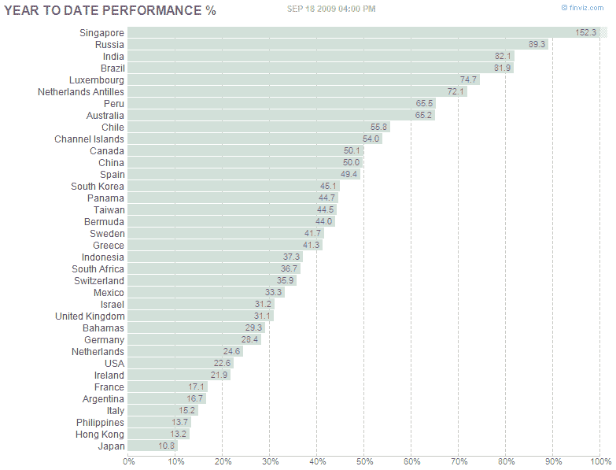

<!--yml

类别：未分类

日期：2024-05-18 17:29:05

-->

# VIX and More: 图表一周：YTD 国家表现

> 来源：[`vixandmore.blogspot.com/2009/09/chart-of-week-ytd-country-performance.html#0001-01-01`](http://vixandmore.blogspot.com/2009/09/chart-of-week-ytd-country-performance.html#0001-01-01)

在这周的[图表一周](http://vixandmore.blogspot.com/search/label/chart%20of%20the%20week)中，我只想说明两点：

1.  如果你将投资集中在美国股票，那么你在 2009 年至今很可能表现不佳，低于全球投资世界的 80%

1.  [FINVIZ.com](http://finviz.com/) 有一些出色的总结图表，用于展示地理区域和部门/行业组的表现及其他指标。

下面的图表就是这样的一个例子。

快速结论？获取全球视野！

有关相关文章，可以尝试搜索：

*[来源：FINVIZ.com]*
