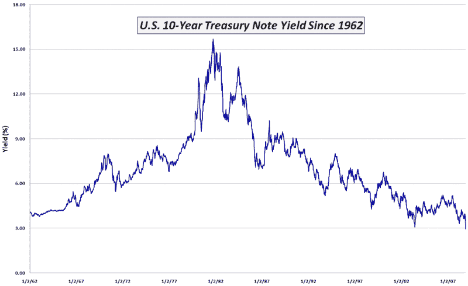

<!--yml

分类：未分类

日期：2024-05-18 18:13:26

-->

# VIX and More: 每周图表：美国 10 年期国债收益率降至 3%以下

> 来源：[`vixandmore.blogspot.com/2008/11/chart-of-week-yields-on-us-10-year.html#0001-01-01`](http://vixandmore.blogspot.com/2008/11/chart-of-week-yields-on-us-10-year.html#0001-01-01)

本周的[每周图表](http://vixandmore.blogspot.com/search/label/chart%20of%20the%20week)看起来现在将成为本空间的常规特色。本周的主题再次聚焦于债券，并延续了上周的避险主题。[ last week](http://vixandmore.blogspot.com/2008/11/chart-of-week-ratio-of-vix-to-yield-on.html) 的图表显示，投资者对安全投资的追求正在升温。下图捕捉了美国[10 年期国债收益率](http://vixandmore.blogspot.com/search/label/10%20Year%20Treasury%20Note)的 46 年完整历史。虽然从图表中难以判断，但这是该债券收益率首次收盘低于 3.0%。低收益率的原因是投资者对安全投资方法的追求，他们认为美国政府债务是资产安全的避风港。

美国政府债务的低收益率有几个有趣的含义。一个含义是，VIX 的下降并不反映政府债券市场的行动。另一个含义是，上升的收益率将表明资金开始从避险投资流向更高的风险投资，如股票。最后，当大部分目前持有政府债务的人认为将这些资产重新部署到股票市场是合适的时候，对股市的潜在需求将是一个需要考虑的强大因素。

*[来源：VIX and More]*
