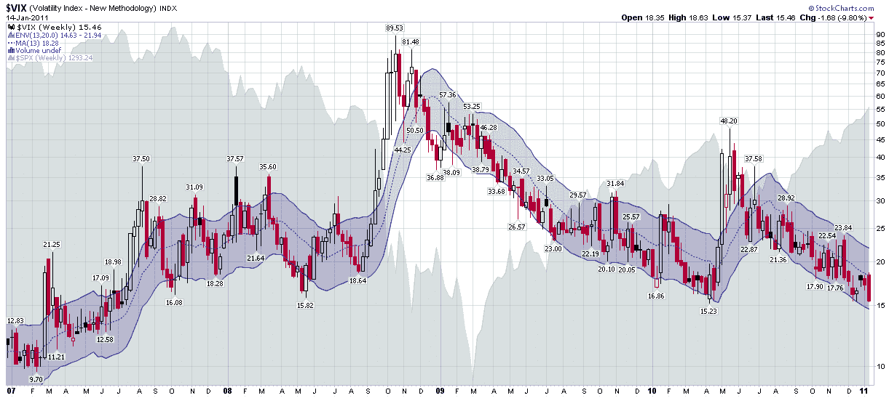

<!--yml

类别：未分类

日期：2024-05-18 16:54:03

-->

# VIX and More：自 2007 年以来的每周图表：VIX

> 来源：[`vixandmore.blogspot.com/2011/01/chart-of-week-vix-since-2007.html#0001-01-01`](http://vixandmore.blogspot.com/2011/01/chart-of-week-vix-since-2007.html#0001-01-01)

[VIX 和波动性年度回顾](http://vixandmore.blogspot.com/2011/01/year-in-vix-and-volatility-2010.html)是两周前的一场巨大成功，我认为现在是时候用一张 CBOE 波动率指数的图表来解决对 VIX 低点的所有焦虑了（是的，VIX 确实有一个正式的名称），该图表追溯到 2007 年初，并包括了 2007 年股市高峰、2008 年恐慌、2009 年底和主导过去两年的涨势。

而在这个领域的大多数图表使用每日 VIX 条和偶尔的[VIX 宏观周期](http://vixandmore.blogspot.com/search/label/VIX%20macro%20cycles)等图表使用每月条，这次我将视角拉回到了对 VIX 使用每周条的视角。就个人而言，我喜欢每周条，因为它消除了周末效应或我喜欢称之为‘[日历回归](http://vixandmore.blogspot.com/search/label/calendar%20reversion)’的效应。更重要的是，我计划在每周时间段内进行交易并执行我的策略，因此每周有[订阅者通讯](http://vixandmoresubscriber.blogspot.com/)。

下图，由 StockCharts.com 提供，是我记忆中第一次见到使用每周[移动平均线包络](http://vixandmore.blogspot.com/search/label/moving%20average%20envelopes)（MAEs）的 VIX 图表。在这种特定变化中，我使用了覆盖了 13 周（一个季度）VIX 数据的 MAEs，并绘制了一个在该 13 周移动平均线上下延伸 20％的包络。结果是一个图表，能很好地捕捉通常是高概率的反向交易的异常值。

图表还显示，如果跌破 15.00 水平，VIX 将回到自 2007 年 7 月以来未曾见过的水平，这恰恰是[Adam Warner](http://www.dailyoptionsreport.com/)和我估计波动性的好时机。*[参见[波动性王牌博主](http://vixandmore.blogspot.com/2007/07/volatility-aces-bloggers.html)获取更多细节。]*

回到移动平均线包络，当前的 VIX 水平在绝对值上相对较低，但是由于每周 13-20 移动平均线包络的下沿目前为 14.63，VIX 穿过下包络的风险似乎极低，至少对于这个观察者来说是如此。

我最好的猜测是，下一次穿越包络更有可能与上涨的 VIX 相关，而不是下跌的 VIX，但即使是这种情况，可能也需要一段时间才能实现。

相关帖子：

*[来源：StockCharts.com]*

***披露：*** *无*
