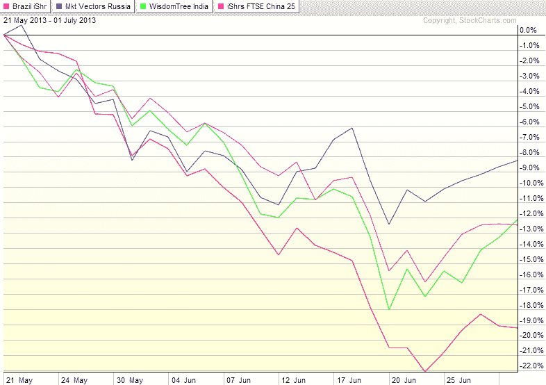

<!--yml

category: 未分类

date: 2024-05-18 16:14:38

-->

# VIX 和更多：图表 BRIC 组成部分近期价格下跌

> 来源：[`vixandmore.blogspot.com/2013/07/charting-recent-decline-of-bric.html#0001-01-01`](http://vixandmore.blogspot.com/2013/07/charting-recent-decline-of-bric.html#0001-01-01)

美国股市在今日的行情中大多呈现绿色，尽管全球股市中有很多红色，特别是在[新兴市场](http://vixandmore.blogspot.com/search/label/emerging%20markets)，流行的[EEM](http://vixandmore.blogspot.com/search/label/EEM)新兴市场 ETF 在我打下这些字时下跌了近 1%，而[巴西](http://vixandmore.blogspot.com/search/label/Brazil) ([EWZ](http://vixandmore.blogspot.com/search/label/EWZ))下跌了超过 2%。

在下面的图表中，我绘制了四个大型[BRIC](http://vixandmore.blogspot.com/search/label/BRIC)新兴市场国家 ETF 最近的价格下跌：巴西 (EWZ)；[俄罗斯](http://vixandmore.blogspot.com/search/label/Russia) ([RSX](http://vixandmore.blogspot.com/search/label/RSX)); [印度](http://vixandmore.blogspot.com/search/label/India) ([EPI](http://vixandmore.blogspot.com/search/label/EPI)); [中国](http://vixandmore.blogspot.com/search/label/China) ([FXI](http://vixandmore.blogspot.com/search/label/FXI)). 尽管在过去六周里，这四个国家 ETF 都有 8%到 20%的下跌，但各个国家遭受的种种困扰似乎在很大程度上是各自国家特有的，尽管显然中国制造业基地和出口市场的问题对巴西有显著的上游影响。

最近，新兴市场总的来说一直在挣扎，但巴西、印度和中国的困难帮助引发了一场全球性的抛售。

在今后，投资者将最好密切关注 BRIC 板块的四个组成部分，以及汇总的 BRIC ETF，如这一领域最受欢迎的品种：iShares MSCI BRIC Index ([BKF](http://vixandmore.blogspot.com/search/label/BKF))。

对于那些有兴趣评估新兴市场总体风险和不确定性的人来说，最近[VEXXM 作为新兴市场波动性和风险的衡量标准](http://vixandmore.blogspot.com/2013/06/vxeem-as-measure-of-emerging-markets.html)是推荐的阅读，提供了关于[VXEEM](http://vixandmore.blogspot.com/search/label/VXEEM)，CBOE 新兴市场 ETF 波动性指数的背景信息和信息。

*[source(s): StockCharts.com]*

相关文章：

***披露：*** *在撰写本文时持有 EEM*
